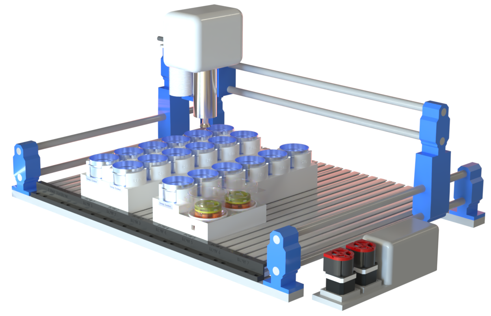
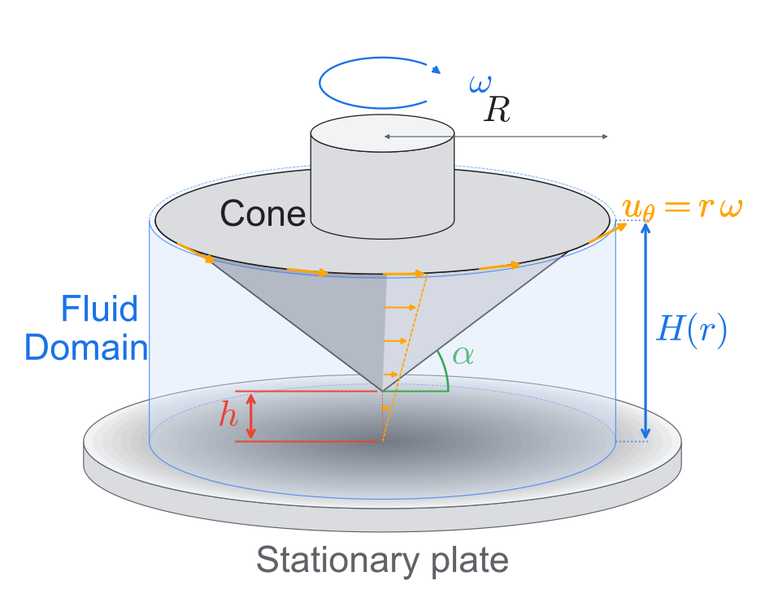
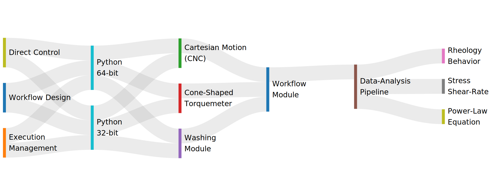

# Automated Viscometry



This repository contains an autonomous viscometry platform that integrates hardware control (CNC stage, rotational torquemeter, and dual-stage washing), asynchronous orchestration, and rheology interpretation pipelines through a web-enabled workflow.

## Project Overview

The Rheological characterization of viscous fluids is a recognized bottleneck in formulation science: manual cone-and-plate rheometry requires tens-of-micrometre gap-setting tolerances incompatible with robotic execution. We present an automated viscometry platform that reframes viscosity acquisition as a signal-interpretation problem rather than a geometric-precision one. A cone-shaped rotational torquemeter, Cartesian motion stage, and dual-stage washing module operate under an asynchronous multi-runtime control architecture; the spindle's descent generates torque-displacement signatures decoded by a physics-constrained pipeline calibrated once on Newtonian silicone oils, recovering viscosity at 3.4% mean absolute error with 95.7% of samples within ±10%. The pipeline converts each descent into a calibrated stress-shear-rate curve and, at multiple rotation rates, the fitted power-law equation τ = Kγ̇n. Across six chemistries spanning five orders of magnitude in viscosity (1-125,000 cP), the platform reproduces reference rheology within ±2×, recovers the flow-behaviour index n from 1.00 (Newtonian) to 0.39 (yield-pseudoplastic), and processes 18 samples in ~5 hour autonomously using under 20 min (7%) of human time — a 4.7-fold reduction versus manual operation. Both outputs come from one universal pipeline with no per-chemistry retuning, evidence that an information-rich workflow can substitute for the precision hardware of manual rheometry. The platform is positioned as the measurement layer for closed-loop rheology-discovery campaigns, where Bayesian optimization and active learning propose formulations that it characterizes autonomously.

## Physics Of The Problem

The platform operates as a modified cone-and-plate configuration in which the cone spindle approaches a stationary plate while torque is monitored as a function of vertical displacement. An automated descent, unlike a manual one, inevitably sweeps a far wider gap range than a human operator would ever program, so the torque trace does not stay within a single hydrodynamic regime: it samples parallel-plate-dominated, transition, and cone-and-plate-dominated behaviour in succession, and no single closed-form solution captures all three at once. We therefore adopt a generalized lubrication-theory framework, in the classical tradition of cone-and-plate and parallel-plate rotational rheometry, that interpolates continuously between the two asymptotic limits.



## Automation Multi-Layer Orchestration Architecture

Diagram of the multi-layer orchestration architecture, with ribbons showing the flow of control and data from the Web Interface, through the Python environments and Hardware, into the Workflow Engine and Data-Analysis Pipeline, and out to the Scientific Outputs.



## Final Rheology Behavior Model

Master flow-curve comparison of representative formulations across material families, plotted as apparent viscosity versus shear rate.


## Autonomous Experiment Video

<video controls width="100%">
    <source src="Media/Video.MP4" type="video/mp4">
    Your browser does not support the video tag. You can download the video <a href="Media/Video.MP4">here</a>.
</video>

Direct hosted video link: [Autonomous Experiment Video](https://github.com/user-attachments/assets/9825e222-a667-4881-9abe-172b20759f9a)

## Required Docs And Paths

Directory tree chart (main required docs/config paths):

```text
Automated_Viscometry/
|-- README.md
|-- pyproject.toml
|-- requirements.txt
|-- requirements_web.txt
|-- setup_requirements.yaml
|-- run_viscometry.py
|-- config/
|   `-- locations.yaml
|-- src/
|   `-- viscometry/
|       |-- run/
|       |   |-- controller.py
|       |   `-- settings.py
|       |-- web/
|       |   `-- app.py
|       `-- hardware/
|           |-- cnc.py
|           |-- pump.py
|           `-- viscometer/
|               `-- client.py
|-- templates/
|   `-- index.html
|-- static/
|-- data/
|   `-- calibration/
`-- results/
    `-- README.md
```

## Main Run Path

1. Launch automation:

```bash
python run_viscometry.py
```

2. Open web interface:

```text
http://localhost:5001
```

## Environment Setup

Use the YAML manifest for mode-specific setup:

```text
setup_requirements.yaml
```

Or standard install:

```bash
python -m pip install -r requirements.txt
python -m pip install -e .
```
