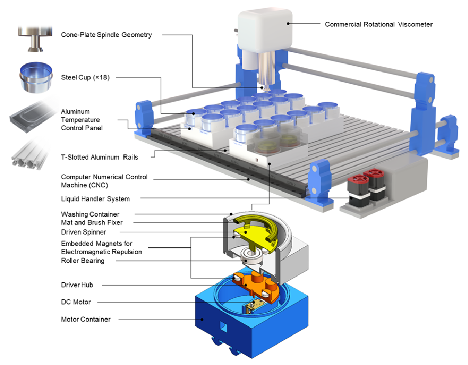
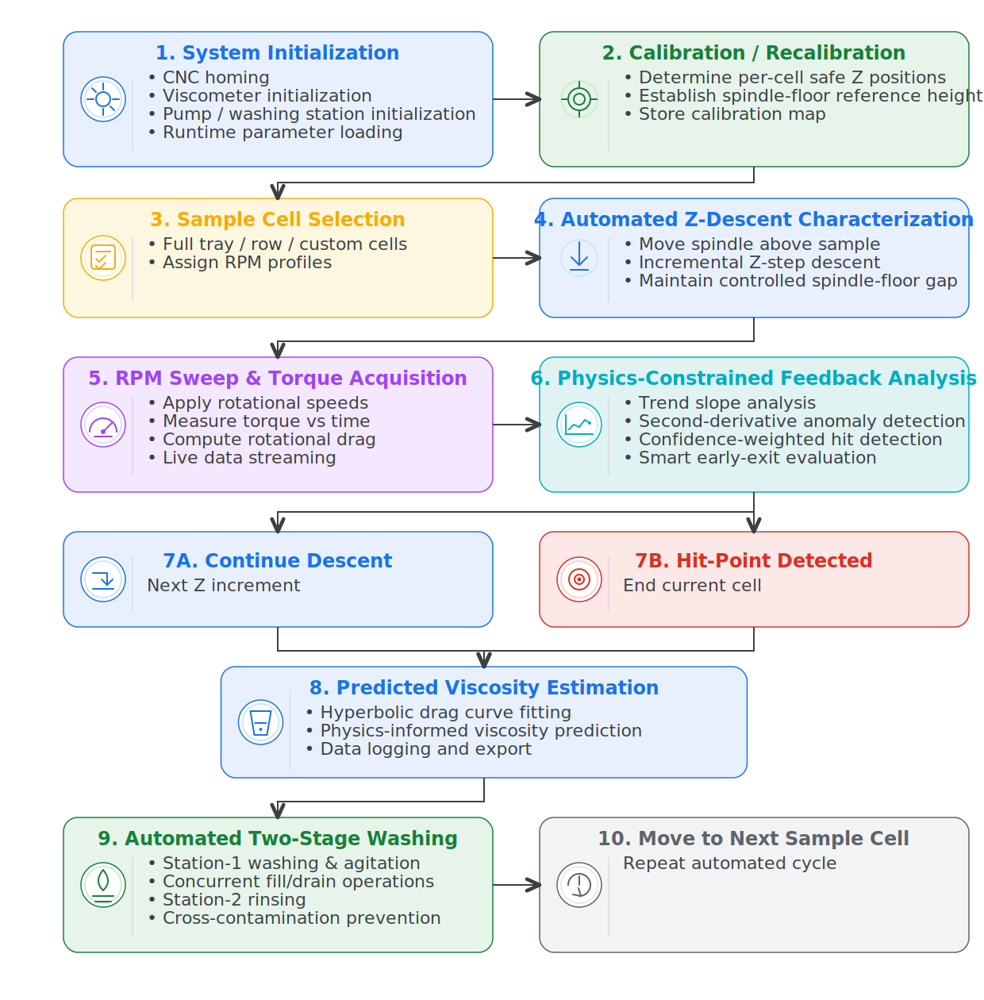
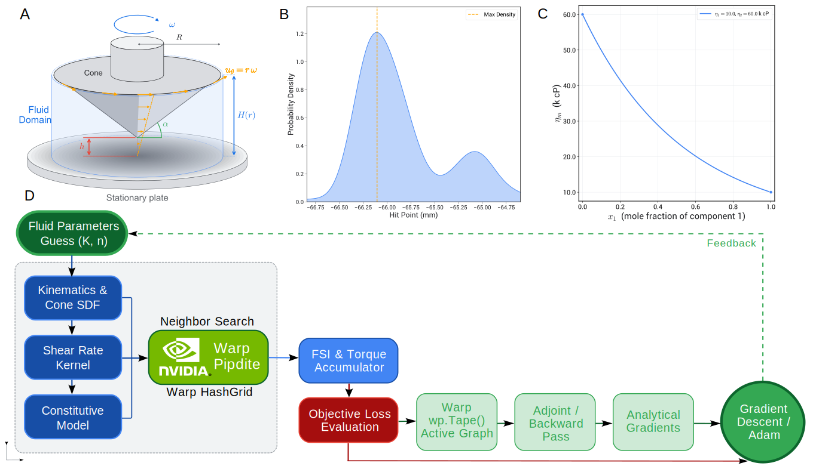
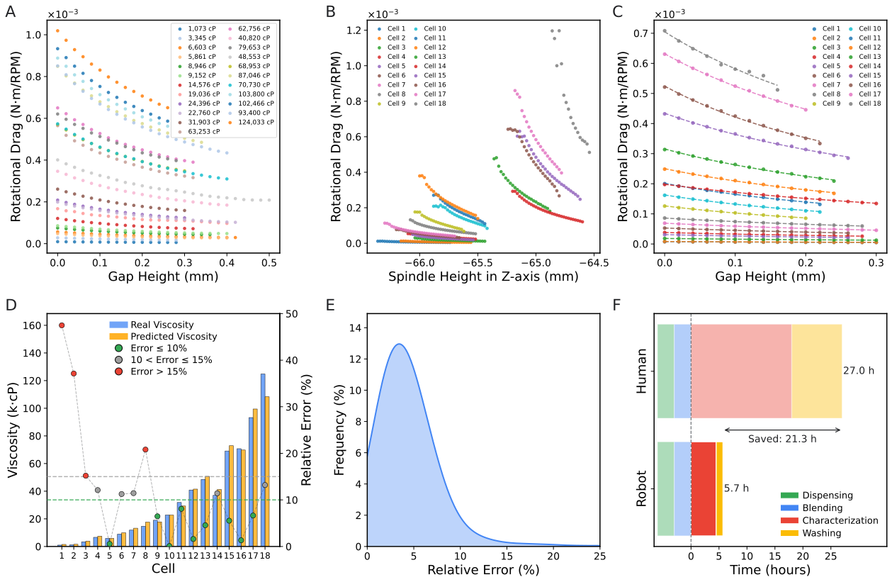
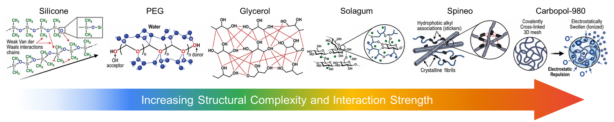

# Autonomous Rheology Discovery in Self-Driving Laboratories for High-Viscosity Formulation Screening via Physics-Constrained Signal Interpretation

Mohammad M Rastegardoost$^{a}$, Ian Ngunga$^{b}$, Koketso Gaborekwe$^{c}$, Frantz Le Devedec$^{a}$

---

## Abstract

The rheological characterization of high-viscosity fluids is a recognized bottleneck in formulation science, where manual cone-and-plate or parallel-plate measurements impose geometric-precision requirements that are fundamentally incompatible with robotic execution. We present an automated viscometry platform that reframes viscosity acquisition as a signal-interpretation problem rather than a geometric-precision problem. A cone-shaped rotational torquemeter is coupled to a Cartesian motion stage, an automated dual-stage washing module, and an asynchronous, multi-runtime control architecture; the descent of the spindle generates torque–displacement signatures that are decoded through a physics-constrained inference pipeline calibrated only once on a Newtonian silicone reference set. The pipeline reduces every raw descent to a calibrated stress–shear-rate curve and, for fluids measured at multiple rotation rates, returns the fitted power-law constitutive equation $\tau = K\,\dot\gamma^{\,n}$ directly. Across mechanistically distinct chemistries — silicone oils, polyethylene glycol, glycerol, polysaccharide gums, associative polymeric thickeners, and crosslinked microgels — the platform recovers the manufacturer-quoted apparent viscosity within a $\pm 2\times$ envelope across the full shear-rate ladder, classifies Newtonian / shear-thinning / yield-stress regimes from the recovered flow-behaviour index $n$, and processes 18 samples within a five-hour autonomous run. The two main outputs of the system — a calibrated stress–shear-rate flow curve and the fitted power-law constitutive equation — are obtained from a single pass through a universal analysis pipeline with no per-chemistry retuning, demonstrating that an information-rich automated workflow can substitute for the precision hardware of conventional rotational rheometry. Beyond its standalone characterization performance, the platform is positioned as the foundational measurement layer of forthcoming rheology-discovery campaigns, in which Bayesian optimization and batch-wise active learning will propose formulations and processing conditions, the proposed samples will be characterized autonomously through this platform, and the recovered flow curves and constitutive coefficients will be fed back into the machine-learning loop to drive closed-loop material discovery across multi-component composition spaces.

**Keywords:** automated rheology, cone-and-plate viscometry, torque–displacement, physics-constrained inference, power-law fluids, self-driving laboratory, Bayesian optimization, active learning, material discovery, high-throughput characterization.

---

## 1. Introduction

The systematic mapping of viscosity in the 1,000–125,000 cP regime underpins the development of lubricants, specialty coatings, pharmaceutical excipients, personal-care emulsions, and advanced adhesives, where the rheological response is the dominant property determining processability, stability, and end-use performance. In these regimes, formulation spaces are typically explored across binary, ternary, or higher-order composition spaces in which viscosity evolves logarithmically and highly non-linearly with composition, so that resolving even a single property landscape can demand hundreds of independent measurements. Manual rotational rheometry, however, is fundamentally limited by its dependence on operator-controlled gap setting, sample loading, cleaning, and sequence pacing: the cumulative human time required to characterize even a modest design of experiments routinely exceeds days of skilled labour, and the inter-operator variance introduced at every step degrades the comparability of measurements collected across different sessions. The combination of long cycle times, operator dependency, and the structural impracticality of multi-component sweeps therefore constitutes a recognized bottleneck that has limited the experimental cadence of formulation development for decades.

A natural response to this bottleneck has been to substitute experimentation with empirical mixing models. The logarithmic blending rule, the Grunberg–Nissan equation, the Ramírez-de-Santiago model, and the Redlich–Kister polynomial framework are widely used to interpolate or extrapolate the viscosity of multi-component mixtures from a small number of pure-component or binary references. These models are quantitatively accurate in the dilute, near-ideal regimes for which they were originally calibrated, but they break down systematically at the concentration extremes and viscosity ranges that are most relevant industrially: hydrogen-bonding networks, associative interactions, polymer-chain entanglement, and microgel structuring all produce non-ideal behaviour that the empirical kernels cannot represent. As a result, even well-parameterized models routinely incur absolute-viscosity errors in excess of 50 % for ternary systems above 10,000 cP, and the absence of a reliable computational surrogate places physical ground-truth measurement back at the centre of any rigorous formulation programme. The accelerating convergence of experimental and computational workflows therefore depends on reducing the cost of the *measurement* itself, not on eliminating it.

The closed-loop integration of robotic sample handling, automated characterization, and machine-learning-guided decision making — collectively termed self-driving laboratories — has emerged as a pragmatic solution to this measurement-cost problem. Self-driving laboratories have been demonstrated convincingly in photovoltaic absorber discovery, heterogeneous catalyst optimization, polymer property design, and reaction-condition screening, where they shorten development cycles by orders of magnitude relative to manual workflows. Rheology, by contrast, remains conspicuously underrepresented in the autonomous-experimentation literature, because automating a rotational viscometer demands a combination of capabilities that few platforms simultaneously possess: sub-millimetre and repeatable spindle positioning across a multi-cell deck, reliable handling and dispensing of fluids with viscosities spanning more than two orders of magnitude, contamination-free sequential measurement of chemically dissimilar formulations, and an analysis layer that can convert the raw output of an imperfect robotic system into rheological descriptors of comparable fidelity to those obtained on a precision benchtop instrument. The intersection of these requirements has, until now, restricted automated rheology to either narrow viscosity ranges, single-chemistry case studies, or workflows in which the human operator remains in the critical path.

Closing this gap requires shifting the burden of precision from the hardware to the analysis pipeline. If the descent of the spindle is sampled densely enough, the resulting torque–displacement signature is information-rich: the *shape* of the rotational drag versus the spindle-to-floor gap encodes the viscosity through a hyperbolic dependence whose amplitude is invertible to an apparent viscosity, while the residual dependence on rotation rate at a fixed gap encodes the flow-behaviour index of the constitutive law. A physics-constrained inference framework can extract both descriptors from a single automated descent without relying on the absolute geometric accuracy of the robotic stage, provided the framework is calibrated once on a Newtonian reference set and applied without modification to subsequent samples. Such a framework converts the two long-standing weaknesses of robotic rheometry — backlash-limited positioning and the absence of an operator-tuned gap — into auxiliary nuisance parameters that the data analysis simply absorbs.

**Scope and objectives of this study.** In this work we develop, validate, and characterize an end-to-end automated viscometry platform whose explicit objective is to deliver, for any high-viscosity fluid loaded into one of its sample cells, two quantitative outputs: (i) a calibrated stress–shear-rate flow curve, and (ii) the fitted power-law constitutive equation $\tau = K\,\dot\gamma^{\,n}$ that summarizes the rheological regime of the sample. The contributions of the work are organized along three complementary axes. From a *mechanical-engineering* perspective, we designed and integrated the Cartesian motion stage, the cone-shaped rotational torquemeter, and the magnetically-driven dual-stage washing station into a single workstation capable of executing fully autonomous measurement and cleaning cycles across a multi-cell sample deck under a unified asynchronous control plane. From a *physics-and-data-science* perspective, we treat the descent of the spindle as a physically structured signal rather than a single-point measurement: a generalized lubrication-theory framework is used to constrain the functional form of the rotational drag, and a data-driven inference layer fitted on top of that physics absorbs the residual mechanical and geometric uncertainties of the robotic stage into nuisance parameters, so that the calibrated apparent viscosity and the flow-behaviour index are recovered directly from the raw torque–displacement signature without per-chemistry retuning. From an *autonomous-experimentation* perspective, we deployed the calibrated platform across mechanistically distinct chemistries (silicone oils, polyethylene glycol, glycerol, polysaccharide gums, associative thickeners, and crosslinked microgels) and verified that it reproduces the manufacturer-quoted reference rheology within a $\pm 2\times$ envelope across the full shear-rate ladder, while completing 18-sample runs in approximately five hours of robot time and fewer than 20 min of human time. Taken together, these three contributions establish the platform as the foundational measurement layer of forthcoming rheology-discovery campaigns, in which Bayesian optimization and batch-wise active learning will propose new formulations and processing conditions, the resulting samples will be characterized autonomously through the platform, and the recovered flow curves and constitutive coefficients will be fed back into the machine-learning loop to drive closed-loop material discovery across multi-component composition spaces.

---

## 2. Methods

The systematic characterization of material flow behaviour requires a clear alignment between the deformation type, the flow regime, and the measurement modality. Although rheology spans extensional, oscillatory, and steady-shear modalities — each yielding a distinct rheological descriptor (**Table 1**) — this study focuses on **steady-state shear rheology** acquired through a **rotational, torque-based** measurement, because this modality is (i) directly automatable on a Cartesian motion stage, (ii) sufficient to recover both Newtonian apparent viscosities and the power-law exponents that classify the dominant non-Newtonian regimes encountered in industrial formulations, and (iii) compatible with the dimensional constraints of a multi-cell sample deck. A standard manual workflow on this modality involves three operator-controlled steps — sample loading into a flat-bottom cell, precise spindle alignment relative to the cell floor, and torque acquisition under a programmed angular velocity — each of which the platform described below replaces with closed-loop, physics-constrained automation.

**Table 1.** Rheological modalities and the descriptor each method recovers.

| Category | Principle / Method | Key Metric |
| --- | --- | --- |
| Deformation Type | Shear Rheology | Shear stress, shear rate |
| | Extensional Rheology | Extensional viscosity |
| Flow Regime | Steady-state Flow | Apparent viscosity |
| | Oscillatory (Dynamic) | Storage ($G'$) and loss ($G''$) moduli |
| Measurement Method | Rotational (Torque-Based) | Torque–displacement |
| | Capillary / Pipe Flow | Pressure drop |
| | Microfluidics | Shear-thinning profile |
| Material Response | Newtonian | Linear stress–strain relationship |
| | Non-Newtonian | Power-law index |
| | Viscoelastic | Phase angle |

### 2.1 Hardware Architecture and Automated Workflow

The complete bill of materials of the platform is summarized in **Table 2**, and the integrated layout is shown in **Figure 1**. Sample containers are stainless-steel, flat-bottom, high-clearance cylinders chosen for their resistance to deformation under the vertical loads applied during near-contact descent; they are arranged in a modular workstation built from T-slotted aluminium rails (McMaster) with custom container holders fabricated by Fused Deposition Modeling (FDM) in PETG filament. The rotational sensing element is a 3°-cone-angle, 12.0 mm-diameter stainless-steel spindle coupled to a precision rotational torquemeter (AMETEK Brookfield; full-scale torque $M_{\mathrm{full}} = 7187$ dyne·cm). After this introduction, the instrument is referred to throughout the manuscript simply as *the rotational torquemeter*, and its quoted manufacturer flow curves are referred to as *the reference rheology*. Three-axis programmable motion is provided by a Cartesian CNC stage (Genmitsu 4040-PRO, SainSmart) actuated by NEMA 17 stepper motors and T10 lead screws. Dedicated peristaltic pumps (Chi.Bio, University of Oxford) handle the cleaning fluids of the integrated washing station.

**Table 2.** Bill of Materials for the automated rheology platform.

| Component | Specification / Model | Manufacturer / Source | Material / Notes |
| --- | --- | --- | --- |
| Robotic Motion | 4040-PRO Desktop CNC | Genmitsu (SainSmart) | Cartesian three-axis stage |
| Rotational Torquemeter | Maximum torque 7187 dyne·cm | AMETEK Brookfield | Real-time torque–displacement |
| Rotational Spindle | Cone, 3° angle, 12.0 mm diameter | AMETEK Brookfield | Stainless steel |
| Sample Containers | Flat-bottom, high-clearance cylinders | Custom / commercial | Stainless steel; deformation-resistant |
| Workstation Layout | T-slotted aluminium rails | McMaster | Modular, scalable layout |
| Container Holders | Custom rail fittings | FDM, PETG (Bambu) | Reconfigurable |
| Washing-Module Housing | Motor container and driving spinner | FDM, PETG | Magnetic-repulsion drive housing |
| Washing Container | High-chemical-resistance vessel | SLA, Rigid 10K Resin (Formlabs) | Solvent-stable |
| Washing Drive | DC motor, 12 mm, 1000:1 gear ratio | Various | Magnetic driving / driven spinner |
| Fluid Management | Peristaltic pumps | Chi.Bio (Univ. of Oxford) | Detergent / water / IPA delivery |
| Cleaning Interfaces | Smooth contact mat and weatherstrip brush | Various | Mat on driven spinner, brush at holder rim |

**Figure 1.** Schematic of the automated viscometry platform showing the Cartesian motion stage, the cone-shaped rotational torquemeter, the multi-cell sample deck, and the integrated dual-stage washing station.

The principal challenge in automating cone-and-plate rheometry is the high-precision spindle-to-floor positioning required to define the measurement gap. A dedicated washing station is therefore integrated into the workstation to clean the spindle after every characterization cycle and prevent cross-contamination between sequential samples. The station uses a bespoke magnetic-repulsion drive in which a motor-driven *driving* spinner — embedded with magnets and housed in a PETG container — actuates a *driven* spinner located inside a separate, chemically-resistant SLA washing vessel (Rigid 10K Resin V1, Formlabs). The two spinners are separated by a 3.0 mm gap and rotate through magnetic repulsion between inversely arranged poles, so that the motor electronics never contact the cleaning fluids. The spindle is cleaned by relative motion against a smooth mat on the driven spinner while detergent, water, and isopropanol are sequenced through the peristaltic pumps. We compared four washing protocols of progressively increasing complexity — from a static spindle in contact with a rotating spinner, through synchronous co-rotation, to lateral *zig-zag* oscillation across the cleaning mat — and found that a multi-modal protocol combining spindle rotation, lateral oscillation, and a brush-fitted spinner produces the only configuration in which no high-viscosity residue is left at the cone perimeter. The augmented mechanical-scrubbing protocol is therefore adopted as the platform default and is executed in parallel with the CNC travel motions to keep the washing time off the critical path of the experimental cycle.

The full process workflow is summarized in **Figure 2**. After system initialization and per-cell calibration of the safe spindle-to-container reference height, the platform executes an automated per-cell characterization cycle in which the spindle descends incrementally toward the container floor while continuously recording torque under a programmed RPM sweep. The descent is regulated by a physics-constrained feedback layer that combines rotational-drag tracking, statistical trend analysis, confidence-weighted hit-point detection, and second-derivative anomaly detection to identify the liquid-contact transition and the optimal termination point of the descent, while protecting the sensor from torque overload. At the end of each measurement, the system initiates a two-stage washing sequence concurrently with the CNC travel to the next cell, and the collected torque–displacement data are passed to the analysis pipeline of §2.2. The full sequence — robotic positioning, torque-based rheometry, physics-informed feedback, autonomous washing, and real-time data orchestration — is closed-loop and operator-free for the duration of the run.

**Figure 2.** Full workflow of the automated viscometry platform. CNC-controlled positioning, torque-based rotational rheometry, physics-informed descent feedback, autonomous hit-point detection, predictive viscosity estimation, and concurrent washing operations form a unified high-throughput experimental loop.

### 2.2 Physics-Informed Rheological Framework

The platform operates as a *modified* cone-and-plate configuration in which the cone spindle approaches the stationary plate while the generated torque is monitored as a function of the vertical displacement. Because automated descent inevitably traverses a much wider gap range than is admissible in a manual cone-and-plate experiment, the torque trace samples three hydrodynamically distinct regimes — parallel-plate-dominated, transition, and cone-and-plate-dominated — and a single closed-form analytical solution is therefore not adequate. We instead adopt a generalized lubrication-theory framework that interpolates continuously between the two asymptotic limits.

The local liquid thickness between the rotating cone and the stationary plate is

$$H(r) = h + r\,\tan\alpha \tag{1}$$

where $h$ is the minimum tip clearance, $r$ is the radial coordinate, and $\alpha$ is the cone half-angle. For large separations $h \gg r\tan\alpha$, $H(r) \to h$, and the torque approaches the parallel-plate scaling

$$T \propto \frac{\mu\,\omega\,R^4}{h}, \tag{2}$$

so that the viscous resistance is dominated by the global gap. For small clearances $h \to 0$, the radial term dominates ($H(r) \approx r\tan\alpha$), the shear rate becomes nearly uniform across the radius, and the torque approaches the classical cone-and-plate limit

$$T = \frac{2\pi}{3}\,\frac{\mu\,\omega\,R^3}{\tan\alpha}. \tag{3}$$

Between these two limits lies a transition regime in which neither approximation is sufficient. Under incompressible, laminar, axisymmetric, low-Reynolds-number conditions, neglecting radial and axial inertia and retaining only the dominant azimuthal motion, the momentum equation reduces to

$$\mu\,\frac{\partial^{2} u_{\theta}}{\partial z^{2}} = 0, \tag{4}$$

with no-slip boundary conditions at the rotating cone and the stationary plate giving the velocity distribution

$$u_{\theta}(r, z) = \frac{\omega\,r\,z}{H(r)}, \tag{5}$$

the local shear stress

$$\tau(r) = \frac{\mu\,\omega\,r}{H(r)}, \tag{6}$$

and, after radial integration of the local viscous moment contributions, the total torque

$$T = 2\pi\,\mu\,\omega\,\int_{0}^{R}\frac{r^{3}}{H(r)}\,\mathrm{d}r. \tag{7}$$

Equation (7) provides a unified, physics-informed descriptor that is continuous across the parallel-plate, transition, and cone-and-plate regimes traversed by the automated descent.

The transition from manual to autonomous rheometry imposes its own precision constraint, because the gap height directly enters the shear-rate calculation. Although the Cartesian stage is built around NEMA 17 stepper motors and T10 lead screws with a manufacturer-quoted running accuracy of $\pm 0.1$ mm, cumulative mechanical uncertainties — backlash, thermal expansion of the metallic guides during continuous operation, and the structural compliance of the 3D-printed PETG fixtures — can push the effective positional variance to nearly 1.0 mm in the worst case. Rather than chase this uncertainty at the hardware level, we exploit the physical structure of equations (1)–(7): the *shape* of the torque-versus-gap signature is a strong function of the fluid viscosity, so a real-time, feedback-driven analysis of the descent can detect both the liquid-contact transition and the safe termination point of the motion without relying on the absolute value of $h$. The physics-informed feedback layer therefore (i) absorbs the residual positional uncertainty as a fitted parameter rather than treating it as a calibration error, (ii) protects the torque sensor from collision-induced overload, and (iii) shortens the descent duration by terminating each cell as soon as the rotational-drag profile has been sampled densely enough for the inference pipeline.

**Figure 3.** Physics-informed measurement framework. The lubrication-theory descriptor of equation (7) interpolates continuously between the parallel-plate ($h \gg r\tan\alpha$) and cone-and-plate ($h \to 0$) limits sampled by the automated descent, and the descent feedback layer absorbs the residual mechanical positional uncertainty into a fitted geometric offset rather than as a hardware-calibration requirement.

### 2.3 Data-Analysis Pipeline from Raw Torque-Displacement Traces to Rheological Behaviour

The analysis layer converts each automated-descent record $(h, T(\%), \mathrm{RPM})$ into calibrated rheological observables through a single, transferable workflow. The full inference chain is shown in **Figure 6** and is executed identically for Newtonian and non-Newtonian materials, with no per-chemistry redesign.

**Figure 6.** Inference-time view of the physics-constrained analysis pipeline. Green annotations mark the universal constants ($h_c^\star$, $k$, $p$, $c_\tau$) calibrated once on silicone standards and reused across all chemistry families.

#### 2.3.1 Signal transformation and scaling diagnosis

The first transformation is rotational-drag normalization,

$$D \equiv \frac{T(\%)}{\mathrm{RPM}}, \tag{8}$$

which removes the trivial Newtonian angular-speed dependence and isolates the geometry-fluid signal. A global and local log-log slope diagnosis on the silicone set showed that no single power law $D \propto h^{-n}$ explains the full descent range: the local slope drifts toward $-1$ only near contact, indicating that a pure $1/h$ model is asymptotically correct but globally incomplete.

**Figure 6a.** Scaling diagnosis of $D(h)$ on the focus silicone. Local slope drift away from $-1$ at intermediate gaps motivates regularization of the hyperbolic form.

To identify the correct baseline structure, an offset-scan was performed by subtracting candidate constants $B$ from $D$ and refitting log-log slope on the positive residual. The resulting plateau near slope $-1$ confirms the leading-order form $D = A/h + B$.

**Figure 6b.** Offset-scan diagnostic. The plateau near slope $\approx -1$ supports a hyperbolic core with a non-trivial baseline term.

#### 2.3.2 Model selection in physical space

Four candidate models were compared in physical space (pure hyperbola, regularized hyperbola, generalized power, and saturation) using bounded Levenberg-Marquardt fitting and ranked by $R^2$, adjusted $R^2$, AIC, BIC, and cross-validated RMSE. The regularized hyperbola was the consistent winner:

$$D(h) = \frac{A}{h + h_c} + B. \tag{9}$$

Here, $A$ carries viscosity information, $h_c$ absorbs effective zero-gap effects (slip layer, asperity, compliance, and residual geometric offsets), and $B$ is a small parasitic baseline.

**Figure 6c.** Physical-space model comparison on the focus silicone dataset.

Residual diagnostics confirm that the selected model is unbiased and near-homoscedastic across gap height, supporting stable downstream inverse calibration.

**Figure 6d.** Residual and distribution diagnostics for the selected regularized-hyperbolic model.

#### 2.3.3 Universality of geometry shape and fixed-$h_c$ production fitting

The factorization hypothesis $D(h,\mu)=A(\mu)F(h)$ was tested by normalizing each sweep by its own maximum and overlaying all silicone traces on a common gap axis. The collapse to a single master shape validates a geometry-governed $F(h)$ and fluid-dependent amplitude $A$.

**Figure 6e.** Dimensionless collapse of silicone drag curves, supporting factorization into geometry shape and viscosity amplitude.

A global fit to the normalized master curve selected the regularized form as the most parsimonious representation, which justifies extracting a universal geometric regularization length $h_c^\star$ for production fitting.

**Figure 6f.** Master-curve construction with bootstrap envelope and best global regularized fit.

Operationally, each sweep is first fitted with free $h_c$, and the median of high-quality fits ($R^2 > 0.7$, $h_c \in [0.05,1.5]$ mm) defines $h_c^\star$. All sweeps are then refitted with fixed $h_c=h_c^\star$, reducing parameter coupling and improving amplitude identifiability.

#### 2.3.4 Calibration equations and constitutive extension

Silicone standards provide the one-shot amplitude-viscosity calibration,

$$\ln A = \ln k + p\,\ln\mu \quad\Longleftrightarrow\quad \mu_{\mathrm{app}} = \left(\frac{A}{k}\right)^{1/p}. \tag{10}$$

For non-Newtonian materials measured at multiple RPM values, amplitude becomes shear-rate dependent,

$$A(\dot\gamma) = A_0\,\dot\gamma^{\,n-1}, \tag{11}$$

so the slope of $\ln A$ versus $\ln\dot\gamma$ yields the flow-behaviour index $n$. Shear stress is computed from percent torque by

$$\tau\,[\mathrm{Pa}] = c_\tau\,T(\%), \qquad c_\tau = \frac{3(M_{\mathrm{full}}/100)}{2\pi R^3} \approx 1.986\ \mathrm{Pa}/\%. \tag{12}$$

Uncertainty and robustness procedures applied uniformly in Results include leave-the-$k$-smallest-out sensitivity, 500-iteration bootstrap confidence bands, and the per-sweep $h_c$-distribution analysis.

### 2.4 Software Orchestration

The hardware-embedding strategy integrates rotational sensing, robotic positioning, and automated washing within a unified control plane. The rotational torquemeter is paired with the three-axis CNC stage to enable programmable sample traversal and repeatable spindle alignment across predefined sample and washing coordinates. All machine-level coordinates — sample positions, washing-station locations, safe-height offsets, and per-cell calibration data — are parameterized through YAML configuration files, so that the deck layout can be reconfigured without modifying the control software. An ESP32 microcontroller serves as the embedded actuator-control layer for the washing subsystem; its custom PCB carries L298N motor drivers under PWM control to actuate six DC pumps and three agitation motors, and a multiplexed channel-sharing configuration with diode-isolated switching provides independent fluid delivery while reducing hardware complexity. The microcontroller executes predefined detergent / water / isopropanol rinse cycles between measurements and exposes only a small command interface to the host (***Supplementary Information***).

At the host level, the platform employs a dual-Python asynchronous architecture that accommodates the hardware compatibility constraints of the rotational torquemeter while keeping experimental orchestration centralized. A 64-bit Python runtime manages high-level workflow execution, CNC motion control via G-code generation, washing-station sequencing, and data logging. Because the proprietary communication library of the rotational torquemeter requires a 32-bit DLL, viscometer communication is isolated within a dedicated 32-bit Python runtime, and the two processes communicate through synchronized file-based exchange and process-level coordination. The software stack is organized into modular hardware-abstraction layers (CNC control, viscometer communication, embedded washing control, and analysis trigger layer), and the ESP32 receives high-level serial commands from the host while executing the corresponding pump and motor sequences independently of the primary orchestration loop. The asynchronous design enables non-blocking concurrent execution of robotic motion, rheological acquisition, and washing operations — the throughput-determining property of the platform — and integrates traceability (calibration status, software version, operator annotations, environmental conditions) and recovery mechanisms (instrument reconnection, safe-motion interruption) to support long-duration autonomous operation. A real-time web dashboard exposes the live torque-displacement traces of every cell, current batch progress, and per-cell acquisition status to the operator, together with manual override, batch-abort, washing-protocol-selection, and calibration triggers, and at the end of every batch generates an automated experimental report containing per-cell summaries and recovered constitutive outputs.

---

## 3. Results and Discussion

The Methods section defines all equations, fitting rules, and uncertainty calculations. Results are therefore presented here as experimental evidence and scientific interpretation of platform performance in two stages: (i) acquisition reproducibility and statistical robustness of the automated measurement layer, then (ii) material-level rheological performance across Newtonian and non-Newtonian classes.

### 3.1 Acquisition Performance: Reproducibility

We first evaluate the reproducibility and statistical stability of automated acquisition before discussing chemistry-specific material outcomes. Across the 1.0–125.0 k cP operating range, normalized rotational-drag signatures collapse to a common shape, while amplitude differences preserve viscosity information (**Figure 4A**). The full 18-sample autonomous campaign (**Figure 4B–F**) confirms that this shape-preserving acquisition remains stable under long-duration operation, with robust parity trends, consistent error distributions, and a practical throughput of 18 samples in approximately five robot-hours.

**Figure 4.** End-to-end automated acquisition performance. (A) Normalized rotational-drag traces collapse onto a common shape across the working range of 1.0–125.0 k cP. (B–D) Acquisition-to-analysis sequence on an 18-sample run: (B) raw rotational-drag data, (C) trimmed traces with fitted regularised profiles, (D) predicted vs. reference apparent viscosity per cell with relative error. (E) Execution reliability across independent runs. (F) Timeline comparison of autonomous vs fully manual workflow.

Reproducibility was then stress-tested using the three diagnostics defined in §2.3. First, leave-the-$k$-smallest-out analysis confirms that the fitted amplitude $A$ changes by less than 5 % even when up to six near-contact points are removed (**Figure 7**, top), indicating low leverage sensitivity and mechanical tolerance to local contact-region noise. Second, 500-iteration bootstrap refitting provides tight 95 % confidence bands for $(A, h_c, B)$ (**Figure 7**, bottom), demonstrating statistical identifiability of the drag model under repeated resampling. Third, the per-sweep regularisation-length distribution remains narrow and unimodal around $h_c^\star \approx 0.277$ mm (**Figure 8**), supporting the interpretation that $h_c$ is a geometry-linked descriptor rather than a chemistry-specific fitting artifact.

From an engineering perspective, these results indicate that backlash, compliance, and wetting variability are absorbed effectively into the fitted regularised representation without destabilizing amplitude recovery. From a scientific perspective, the observed master-shape consistency supports a transferable drag-profile factorization across formulations. From a statistical perspective, sensitivity, bootstrap, and parameter-distribution diagnostics agree that uncertainty in the fitting layer is sub-dominant to cross-material viscosity variation, enabling reliable downstream constitutive interpretation.

To verify that this reproducibility extends across distinct interfacial and microstructural environments, we deployed the acquisition layer on mechanistically diverse systems (**Figure 5**), including polymeric entanglement fluids (silicones, PEG), molecular liquids (glycerol), polysaccharide-thickened systems (Solagum), associative networks (Sepineo), and crosslinked microgels (Carbopol 980). Stable hit-point detection and contamination-free sequential operation confirm that automated acquisition robustness is not limited to a single calibration-fluid family.

**Figure 5.** Cross-chemistry acquisition validation set. The investigated systems span polymeric entanglement (silicones, PEG), molecular friction (glycerol), polysaccharide thickening (Solagum), associative networks (Sepineo), and crosslinked microgels (Carbopol 980), each imposing distinct interfacial and mechanical signatures on the descent.

**Figure 7.** Robustness diagnostics of the regularised-hyperbolic fit on the focus silicone. (Top) Leave-the-$k$-smallest-out sensitivity: the fitted amplitude $A$ remains stable to within a few percent as up to six near-contact points are sequentially removed, certifying that the calibration is not driven by ill-conditioned small-gap data. (Bottom) 500-iteration bootstrap 95 % confidence band and posterior histograms of $(A, h_c, B)$, demonstrating that parametric uncertainty is sub-dominant to the downstream viscosity error.

The universality of the geometric regularisation length is shown in **Figure 8**.

**Figure 8.** Production-pipeline confirmation that the regularisation length is universal. The histogram of per-sweep $h_c$ values (free-$h_c$ first pass) is tight, unimodal, and viscosity-independent. The red line marks the adopted $h_c^\star \approx 0.277$ mm used to refit every sweep, reducing the analysis from a three-parameter to a two-parameter problem and eliminating the entanglement between $A$ and $h_c$ in the inverse calibration.

### 3.2 Material Performance: Newtonian and Non-Newtonian Fluids

With reproducibility established at the acquisition layer, we next evaluate material-level rheological performance using the fixed pipeline of §2.3.

#### 3.2.1 Lubricant (Silicone)

Silicone oils act as the Newtonian anchor set and confirm that amplitude-based decoding maps directly to stable apparent viscosity recovery over more than two decades. The calibration trend between fitted amplitude and labelled viscosity remains monotonic and near-linear in log-log space (**Figure 9**), and parity against reference values stays within the target error envelope over the measured shear-rate window.

**Figure 9.** Silicone Newtonian material-performance map used for quantitative decoding of apparent viscosity in the fixed pipeline.

#### 3.2.2 Rheology Modifier Materials (PEG-600k, Solagum, Carbopol, and Sepineo)

For rheology modifiers, multi-RPM sweeps reveal non-Newtonian behaviour through shear-rate-dependent amplitude trends. PEG-600k occupies a moderate shear-thinning regime, while Solagum and Sepineo show stronger thinning signatures, and Carbopol approaches a near-yield-stress limit. These behaviours are captured consistently by the same calibrated workflow, without re-parameterization by chemistry.

**Figure 10.** Material-level amplitude flow curves for PEG-600k, Solagum, Carbopol, and Sepineo. Dashed log-log slopes separate the rheology-modifier families by flow behaviour.

To make the transformation from raw descent data to constitutive interpretation explicit, we include two intermediate views. Figure 10a shows per-polymer drag profiles $D(h)$ at each RPM; the family-specific response is expressed primarily as vertical amplitude shift while preserving the fitted profile form. Figure 10b then shows reconstructed apparent viscosity trajectories $\mu_{\mathrm{app}}(\dot\gamma)$ obtained by inverting amplitudes through the silicone calibration.

**Figure 10a.** Polymer-family drag profiles across RPM ladders, illustrating consistent profile geometry with shear-rate-dependent amplitude.

**Figure 10b.** Apparent-viscosity flow curves reconstructed from amplitude calibration for modifier materials.

A consolidated stress-shear-rate view confirms separation of Newtonian and non-Newtonian families while preserving parity with the independent reference rheology.

**Figure 11.** Master rheogram of Newtonian and rheology-modifier datasets. The slope transition from unit-slope silicone responses to lower-slope modifier families indicates consistent non-Newtonian classification.

**Figure 12.** Per-sweep parity against the reference rheology across silicone and rheology-modifier materials. Most points remain inside the $\pm 2\times$ engineering acceptance envelope.

An additional parity view using the polymer-focused discovery aggregation confirms this agreement at the family level over matched shear-rate points.

**Figure 12a.** Polymer-focused parity against matched-shear reference values using amplitude-decoded apparent viscosity.

Family-resolved overlays further show that measured points, fitted constitutive curves, and independent reference values remain aligned by family, indicating that a single calibrated code path can recover rheology from moderate to strong shear-thinning response.

**Figure 13.** Per-family rheograms on linear axes. Filled circles: platform measurements; solid lines: fitted constitutive response; open stars: independent reference values.

#### 3.2.3 Thermal Interface Materials (to be added)

Thermal Interface Materials (TIMs) will be incorporated as a dedicated material class in a subsequent dataset expansion. The same analysis and reporting template used for lubricants and rheology modifiers will be applied: amplitude scaling, stress-shear-rate reconstruction, parity testing against reference rheology, and family-resolved constitutive interpretation.

---

## 4. Conclusion

We have presented an end-to-end automated viscometry platform that delivers, for any high-viscosity fluid loaded into one of its sample cells, two quantitative outputs — a calibrated stress–shear-rate flow curve and the fitted power-law constitutive equation — through a single physics-constrained inference pipeline applied directly to the raw torque–displacement output of an automated descent. The platform integrates a Cartesian motion stage, a cone-shaped rotational torquemeter, a magnetically-driven dual-stage washing station, and an asynchronous multi-runtime control architecture; the inference pipeline interpolates continuously between the parallel-plate and cone-and-plate limits using a regularised-hyperbolic drag fit anchored by a universal geometric offset $h_c^\star$, a one-shot silicone power-law calibration $A = k\,\mu^{\,p}$, and a single cone-plate stress conversion $c_\tau$. The calibrated pipeline reproduces the manufacturer-quoted reference rheology of mechanistically distinct chemistries — silicone oils, polyethylene glycol, glycerol, polysaccharide gums, associative thickeners, and crosslinked microgels — within a $\pm 2\times$ envelope across the full shear-rate ladder, classifies Newtonian, shear-thinning, and yield-stress regimes from the recovered flow-behaviour index $n$, and processes 18 samples within a five-hour autonomous run with fewer than 20 min of human time. The platform therefore demonstrates that the long-standing weaknesses of robotic rheometry — backlash-limited positioning and the absence of an operator-tuned gap — can be absorbed as nuisance parameters by a sufficiently information-rich physics-constrained analysis layer, and that an automated workflow can substitute for the precision hardware of conventional manual rotational rheometry without sacrificing the fidelity of either of its two primary descriptors.

The immediate application of the platform is as the foundational measurement layer of forthcoming rheology-discovery campaigns, in which Bayesian optimization and batch-wise active learning will propose new formulations and processing conditions, the resulting samples will be characterized autonomously through the platform, and the recovered flow curves and constitutive coefficients will be fed back into the machine-learning loop to drive closed-loop material discovery across multi-component composition spaces. Building on this foundation, future extensions of the framework will (i) generalize the constitutive layer beyond steady power-law fluids to Herschel–Bulkley yield-stress and Maxwell viscoelastic models, (ii) develop the inverse rheological problem of inferring molecular-level interaction parameters from torque–displacement signatures, (iii) couple the platform to inline spectroscopic characterization (NIR, Raman) for simultaneous compositional and rheological monitoring, and (iv) scale the architecture to larger multi-spindle decks for use as the rheological characterization layer of a self-driving formulation laboratory.

---

## 5. Supplementary Information

* Full Bill of Materials (Table S1).
* CNC calibration map methodology and positional-variance dataset.
* Lubrication-theory validation against the analytical parallel-plate and cone-and-plate limits.
* Full washing-protocol comparison data and visual residue analysis.
* PCB design and embedded motor-control architecture of the automated washing subsystem.
* Software orchestration and asynchronous communication architecture of the autonomous platform.
* Raw torque–displacement traces for all batches.
* Sensitivity, bootstrap, and cross-validation diagnostics of the regularised-hyperbolic fit.

**Figure S1.** PCB design and embedded motor-control architecture of the automated washing subsystem.

**Figure S2.** Software orchestration and asynchronous communication architecture of the autonomous rheological characterization platform.

---

