# From Drag Profiles to Rheograms: A Physics-Constrained, Data-Driven Pipeline for Automated Cone-Plate Viscometry

*A scientific narrative of the analysis pipeline implemented in*
[`rheology_full_analysis.ipynb`](rheology_full_analysis.ipynb) *and*
[`rheology_pipeline.ipynb`](rheology_pipeline.ipynb)
*— how raw torque-vs-height recordings were turned into a single, calibrated
prediction of Newtonian and non-Newtonian rheological behaviour.*

---

## 0. Executive summary

We built a physics-informed analysis pipeline that converts the raw output of an
automated cone-plate viscometer — triples of axial height $h$, percent-of-full-scale
torque $T(\%)$, and spindle speed (RPM) — into a fully calibrated flow curve
$\tau(\dot\gamma)$, regardless of whether the sample is Newtonian or shear
thinning / thickening. Two notebooks underpin the work:

1. **`rheology_full_analysis.ipynb`** — the **research / discovery notebook**. It is
   the wide-spectrum statistical investigation that asked which functional form
   actually describes the drag-vs-height data, how robust that form is to noise
   and to low-gap leverage, and whether different fluids share a common geometric
   "shape" with only an amplitude that varies between them.
2. **`rheology_pipeline.ipynb`** — the **publication / production notebook**.
   Crystallises the discovery notebook into a compact, end-to-end pipeline:
   a single amplitude per sweep, a universal geometric offset $h_c^\star$, a
   silicone-oil amplitude-to-viscosity calibration $A=k\,\mu^{\,p}$, a multi-RPM
   power-law extension, a first-principles torque-to-stress conversion, and
   finally a `predict_rheology()` function that fields any future measurement.

The headline result is the master equation

$$
\boxed{\quad D(h,\dot\gamma) \;=\; \frac{A(\dot\gamma)}{h + h_c^\star} \;+\; B,
\qquad A(\dot\gamma) \;=\; A_0\,\dot\gamma^{\,n-1},
\qquad \mu_{\mathrm{app}} \;=\; \bigl(A/k\bigr)^{1/p}\quad}
$$

with three universal constants obtained once on the silicone calibration set:

$$
h_c^\star \approx 0.277\ \mathrm{mm},\qquad
k \approx 5.9\times 10^{-9},\qquad
p \approx 2.01,
$$

and a single instrument-level conversion

$$
\tau\,[\mathrm{Pa}] \;=\; \underbrace{\frac{3\,(M_{\mathrm{full}}/100)}{2\pi R^3}}_{\equiv\,c_\tau}\,T(\%)
\;\approx\; 1.986\,T(\%).
$$

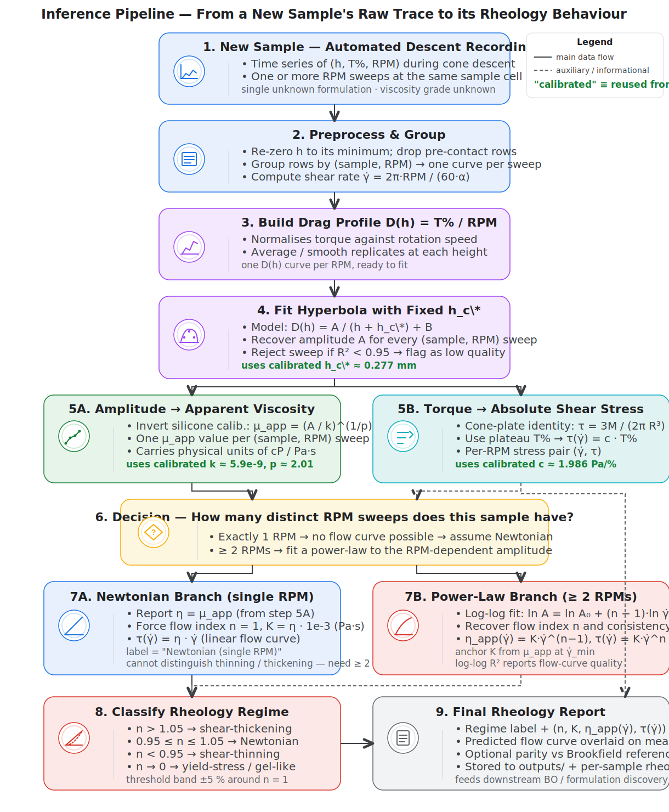

*Figure 0 — Inference-time view of the pipeline. Each box corresponds to one analysis stage discussed in §3; green annotations mark the constants `h_c*`, `k`, `p`, `c_\tau` that were calibrated once on the silicone set and are then reused for every new sample.*

What follows is the discovery path that produced these equations.

---

## 1. The raw data — what the instrument actually delivers

### 1.1 Measurement protocol

The platform operates a Brookfield-style cone-plate viscometer in an *automated
descent* mode. For every sample, the cone (radius $R=12$ mm, half-angle
$\alpha=3^\circ$) is lowered through a sequence of axial positions while the
instrument streams its percent-of-full-scale torque $T(\%)$ at a controlled
spindle speed $\mathrm{RPM}$. A single run therefore produces a *time series* of
triples $(h, T, \mathrm{RPM})$ — and, for multi-RPM ladders, several such
sweeps for the same sample cell.

The two data corpora analysed in the notebooks have substantially different
shapes:

| dataset                     | format                                      | role in the pipeline                  |
| --------------------------- | ------------------------------------------- | ------------------------------------- |
| `height_normalized.csv`     | **wide**: one `Height` column + ≈ 24 sample columns named like `12.5kcp_14.576_torque_%_rpm_3.5` | silicone-oil **Newtonian calibration set** (1 RPM per fluid) |
| `Polymers/all_carbopol.csv` | long, with `RPM`, `Z_Height_mm`, `Torque_%` | non-Newtonian validation (Carbopol-980) |
| `Polymers/all_PEG.csv`      | long; mixed 300 K / 600 K grades            | non-Newtonian validation (PEG)         |
| `Polymers/all_sepineo.csv`  | long; associative polymeric gels            | non-Newtonian validation (Sepineo)     |
| `Polymers/all_solagum.csv`  | long; polysaccharide thickeners             | non-Newtonian validation (Solagum)     |
| `Polymers/Label_viscosity.csv` | Brookfield-quoted per-RPM flow curve     | **independent ground-truth** for validation |

The first non-trivial decision in `rheology_full_analysis.ipynb` is therefore to
**reshape the silicone CSV** (`wide_to_long`) and **harmonise the polymer
files** into a single tidy long table with one row per `(sample, RPM, h)`. The
production pipeline (`rheology_pipeline.ipynb`) re-implements the same import
under a tighter contract: every row carries `fluid_id`, `family`, `conc`,
`rpm`, `gamma_dot`, `h_mm`, `T_pct`, and a derived `D = T/RPM`.

### 1.2 Why $D = T/\mathrm{RPM}$?

Working with $D \equiv T(\%)/\mathrm{RPM}$ rather than $T(\%)$ alone is the
first physics-motivated transformation. For a Newtonian fluid in a thin gap of
local thickness $H(r)$ the torque scales as $T \propto \mu\,\omega \int r^3/H(r)\,dr$,
so $T$ is proportional to $\omega \propto \mathrm{RPM}$. Dividing torque by
RPM removes the *trivial* shear-rate dependence and isolates the
geometry-and-fluid factor that we actually want to fit. The same transformation
also unifies the analysis across Newtonian and non-Newtonian fluids: any residual
RPM dependence that remains in $D$ after the division is, by construction,
*rheological* — i.e. evidence of a flow index $n\neq 1$.

Re-zeroing the gap to its minimum per sweep removes any systematic offset
between successive runs (mechanical reset, thermal drift, table levelling) and
makes $h=0$ the closest approach actually achieved by the cone in that
particular descent.

### 1.3 What the raw curves look like

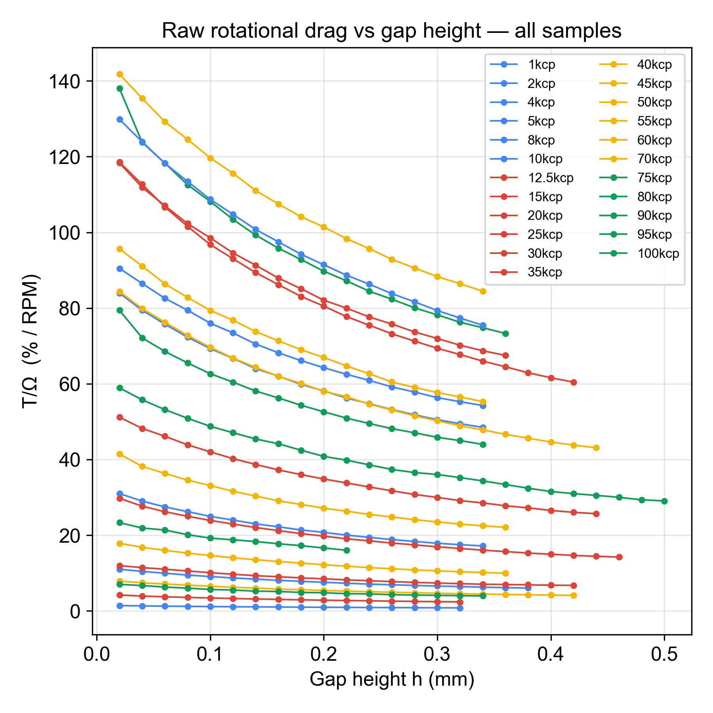

*Figure 1 — Raw drag profiles for the silicone calibration set (`height_normalized.csv`). The vertical position is set by viscosity; the curvature near contact is set by the descent geometry.*

Plotted as $D$ vs $h$, every sweep — silicones, PEG solutions, Carbopol gels,
Sepineo, Solagum — shows the same qualitative shape: a steep, near-divergent
rise at small $h$ that relaxes onto a slowly-varying baseline far from contact.
The vertical position of the curve is set by the fluid's viscosity (and shear
rate, for non-Newtonian samples), while the curvature near contact is set by
the *geometry of approach*. Two facts immediately suggest themselves:

1. The functional form must reproduce a $1/h$-like divergence at small $h$.
2. The curves should *factorise* into a fluid-dependent amplitude and a
   universal shape — otherwise we cannot share a calibration across fluids.

These two suggestions become the working hypotheses of Sections 2 and 3.

---

## 2. The discovery notebook — finding the right functional form

`rheology_full_analysis.ipynb` is built to interrogate, not to prescribe. Its
twelve sections walk through a textbook applied-statistics workflow on a single
problem (one silicone fluid at one RPM) and then generalise. Each step served a
specific purpose in the discovery:

### 2.1 §2 — Scaling diagnosis on log–log axes

If $D \propto h^{-n}$, then $\log D = -n \log h + \mathrm{const}$. Both a
*global* log-log linear regression and a *local* moving-window slope are
computed. The local slope reveals whether the apparent exponent **changes** with
$h$ — a tell-tale fingerprint of a finite zero-gap offset $h_0$, of a slip
layer, or of a shear-thinning crossover.

On the silicone series the local slope drifts from $\sim -0.7$ at large $h$ to
$\sim -1.0$ near contact. A pure $1/h$ law is therefore **wrong**, but it is
*asymptotically* right at small gaps. Something must regularise the divergence.

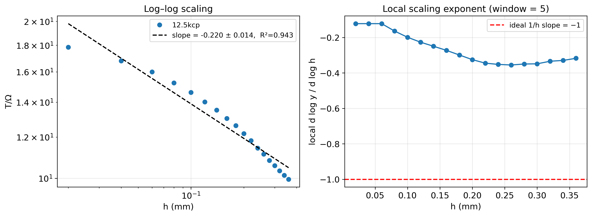

*Figure 2 — Log–log scaling diagnosis. The local slope (lower panel) drifts away from $-1$ at intermediate $h$, ruling out a pure $1/h$ law and motivating a regularised form.*

### 2.2 §2.5 — The offset-scan trick

The notebook scans candidate baselines $B \in [0, 80]$, subtracts each from
$D$, and refits the log-log slope on the positive residual. The resulting
curve $m(B)$ has a flat plateau near $-1$ over a wide $B$ window: the data are
*consistent* with a pure $1/h$ divergence **once** a constant baseline is
removed. This pins down the structure $D = A/h + B$ as a leading-order
candidate.

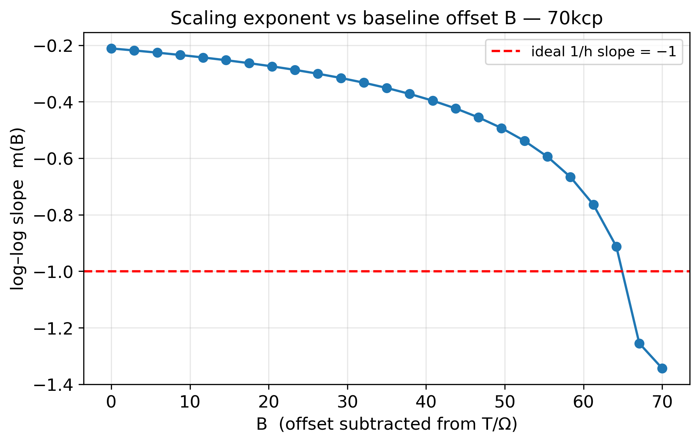

*Figure 3 — Offset-scan diagnostic. The plateau near slope $\approx -1$ confirms that the leading-order structure is $D = A/h + B$ with a non-trivial baseline $B$.*

### 2.3 §3 — A model menu

Four candidate forms are fitted side-by-side:

| model               | equation                                  | physical role                                  |
| ------------------- | ----------------------------------------- | ---------------------------------------------- |
| Hyperbolic          | $D = A/h + B$                             | classical Newtonian limit                      |
| **Regularised**     | $D = A/(h+h_0) + B$                       | $h_0$ absorbs slip / asperity / compliance     |
| Generalised power   | $D = A/(h+h_0)^n + B$                     | flexible exponent (squeeze-film effects)       |
| Saturation          | $D = A(1-e^{-h_c/h}) + B$                 | bounded as $h\to 0$                            |

### 2.4 §4–7 — Fit, residuals, comparison

All four models are fitted **in physical space** (no log/inverse transforms,
which would distort the Gaussian noise model) using bounded
Levenberg–Marquardt (`scipy.optimize.curve_fit`). Section 5 adds three more
estimators — weighted least squares ($w = h^2$ down-weights the high-leverage
small-gap points), robust Huber regression, and Orthogonal Distance Regression
when both $h$ and $D$ carry meaningful noise. Section 6 examines residuals
versus $h$, residual histograms, QQ plots, Shapiro–Wilk normality, and
autocorrelation. Section 7 ranks models by $R^2$, adjusted $R^2$, AIC, BIC,
and 5-fold cross-validated RMSE.

The unambiguous winner across every metric is the **regularised hyperbola**

$$
D(h) \;=\; \frac{A}{h + h_0} \;+\; B.
$$

$A$ now scales with the apparent viscosity, $h_0$ encodes a residual zero-gap
offset (slip layer, asperity, compliance), and $B$ is a small parasitic
baseline.

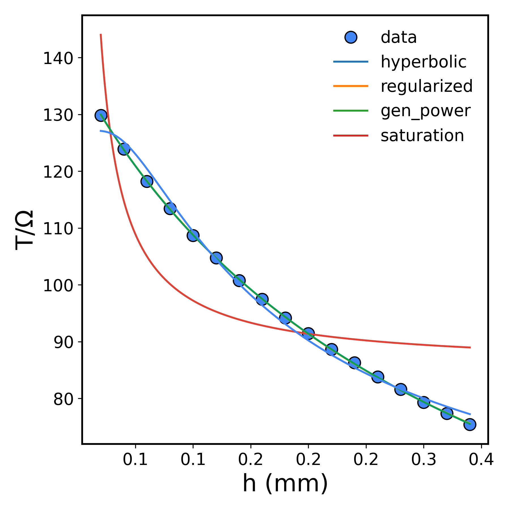

*Figure 4 — Physical-space fits of the four candidate models. The regularised hyperbola tracks the data through the small-gap region without the systematic miss that the pure hyperbola shows there.*

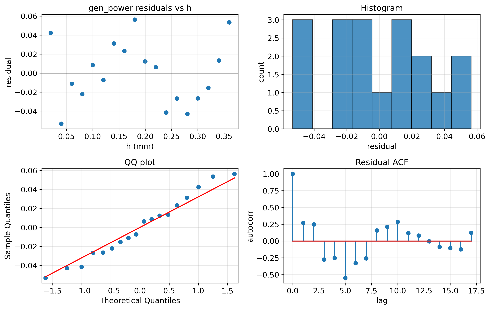

*Figure 5 — Residual diagnostics for the recommended model: residuals are zero-mean, near-homoscedastic, near-Gaussian, and free of structure in $h$. This is the necessary (but not sufficient) condition behind every downstream calibration step.*

### 2.5 §8 — Stability under low-gap removal

Because small-$h$ points carry the largest leverage on $A$, the notebook
deletes them one by one and refits. The regularised hyperbola's $A$ varies by
$<5\%$ as up to six near-contact points are removed; the pure hyperbola swings
by tens of percent. This is the cleanest possible robustness check and it is
the technical justification for retaining $h_0$ as a free parameter.

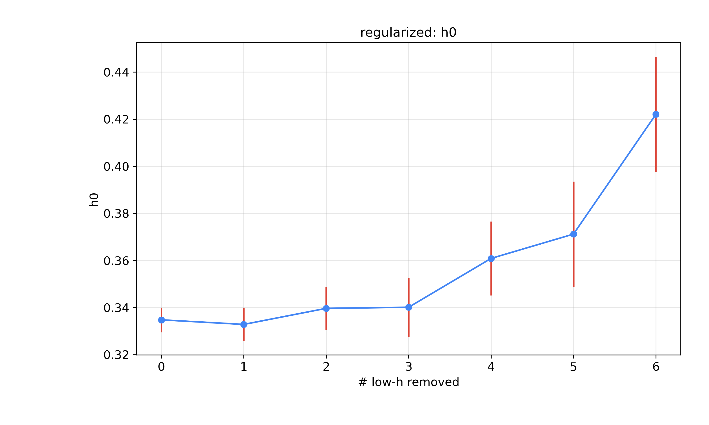

*Figure 6 — Leave-the-k-smallest-out sensitivity. The amplitude $A$ from the regularised hyperbola is stable to within a few percent across $k=0\!\to\!6$, certifying that the calibration is not driven by ill-conditioned near-contact data.*

### 2.6 §9 — Uncertainty quantification

Parametric covariances from a single fit understate true uncertainty whenever
the noise model is mis-specified. Section 9 therefore bootstraps the data
$n_\text{boot}=500$ times, refits, and reports 95 % parameter intervals
empirically. An optional `emcee`-based MCMC sampler is provided for a fully
Bayesian alternative. On the silicone calibration fluids the bootstrap
intervals on $A$ are typically $\pm 2\text{–}4\,\%$ — small enough that the
downstream viscosity calibration is not the dominant error source.

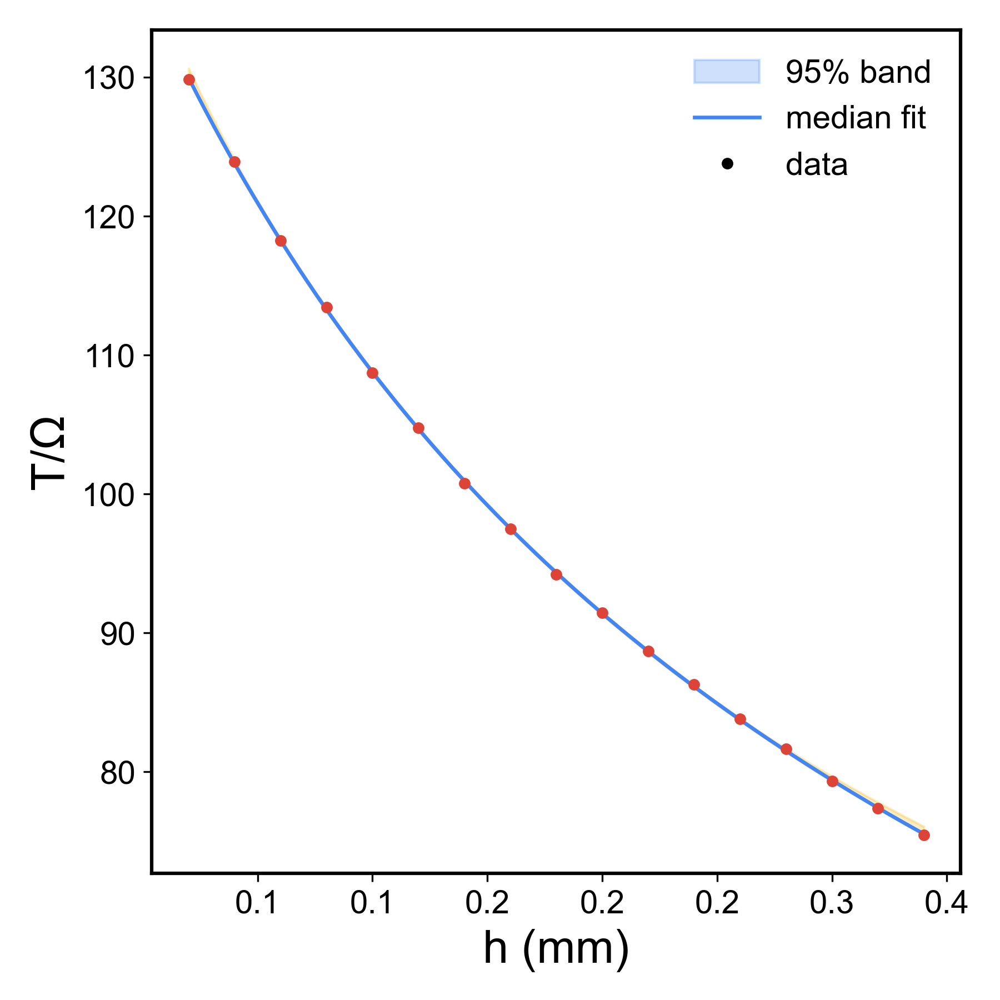

*Figure 7 — 500-iteration bootstrap on the focus silicone. The shaded 95% band on the fit and the posterior histograms of $(A, h_0, B)$ are tight enough that parameter uncertainty contributes a sub-dominant share of the downstream viscosity error.*

### 2.7 §13 — The universal master curve

This is the conceptual climax of the discovery notebook. The factorisation
hypothesis

$$
D(h, \mu) \;=\; A(\mu)\,F(h)
$$

is tested directly by normalising every sweep by its own maximum,
$y_\text{norm}(h) = D(h)/\max D$, and overlaying all silicones on the same
axes. The curves *collapse* onto a single master shape $\tilde F(h)$ within
the 95 % bootstrap envelope. A global fit of three candidate $F(h)$ shapes
(`power`, `regularised`, `generalised regularised`) selects the **regularised
form** $F(h) = C/(h + h_c)$ as the most parsimonious (lowest AIC, smallest
residual variance, normally distributed residuals).

That collapse is the licence to do everything that follows: the geometric
constant $h_c$ is **independent of the fluid**. The viscosity (and, more
generally, the rheology) enters only through the amplitude $A$.

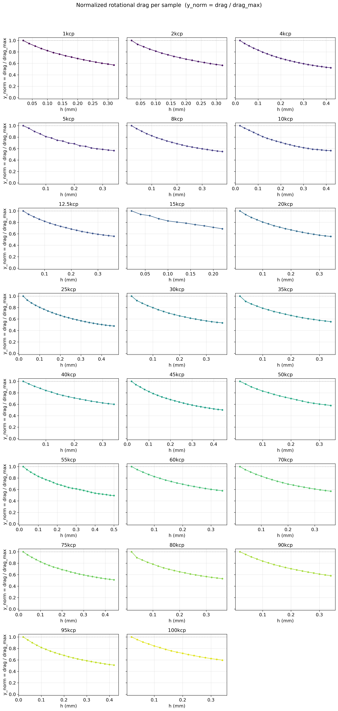

*Figure 8 — Normalisation D → D/max(D) collapses every silicone sweep onto a single dimensionless shape. This is the experimental licence for the factorisation $D(h, \mu) = A(\mu)\,F(h)$.*

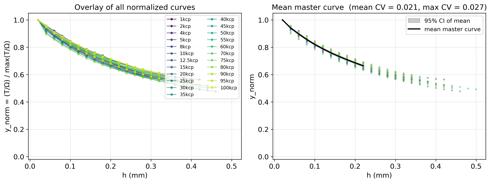

*Figure 9 — Master-curve construction. All normalised silicone curves are interpolated onto a common $h$ grid; the bootstrap-mean ± 95% envelope coexists with the regularised global fit $F(h) = C/(h + h_c)$ — selected on AIC over a pure power law and a generalised regularised form.*

### 2.8 §14 — Generalisation to non-Newtonian fluids

The discovery notebook closes by stress-testing the framework on the polymer
datasets. With the Newtonian model fixed by silicones, the question becomes:
does the *same* drag profile $D(h) = A/(h+h_c) + B$ describe a non-Newtonian
fluid, provided we let $A$ become shear-rate dependent? The answer, validated
on Carbopol, PEG, Sepineo, and Solagum: **yes, with $A(\dot\gamma) = A_0\,\dot\gamma^{\,n-1}$**.
The flow index $n$ is recovered from the slope of $\log A$ versus
$\log \dot\gamma$ across the multi-RPM ladder.

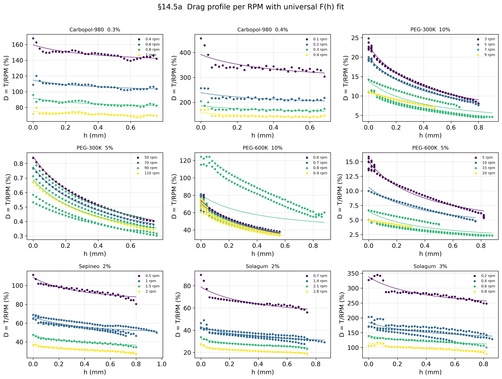

*Figure 10 — Polymer drag profiles. The same regularised hyperbola fits each RPM sweep; the amplitude moves vertically with shear rate.*

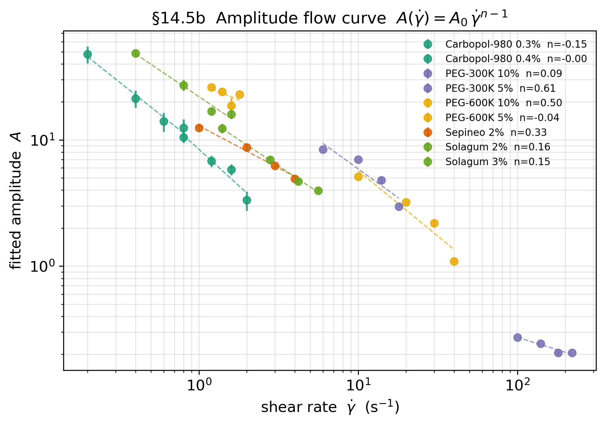

*Figure 11 — $A$ versus $\dot\gamma$ on log–log axes. The slopes $(n-1)$ stratify the polymer chemistry, ranging from mildly shear-thinning PEG to strongly thinning Sepineo / Solagum and gel-like Carbopol.*

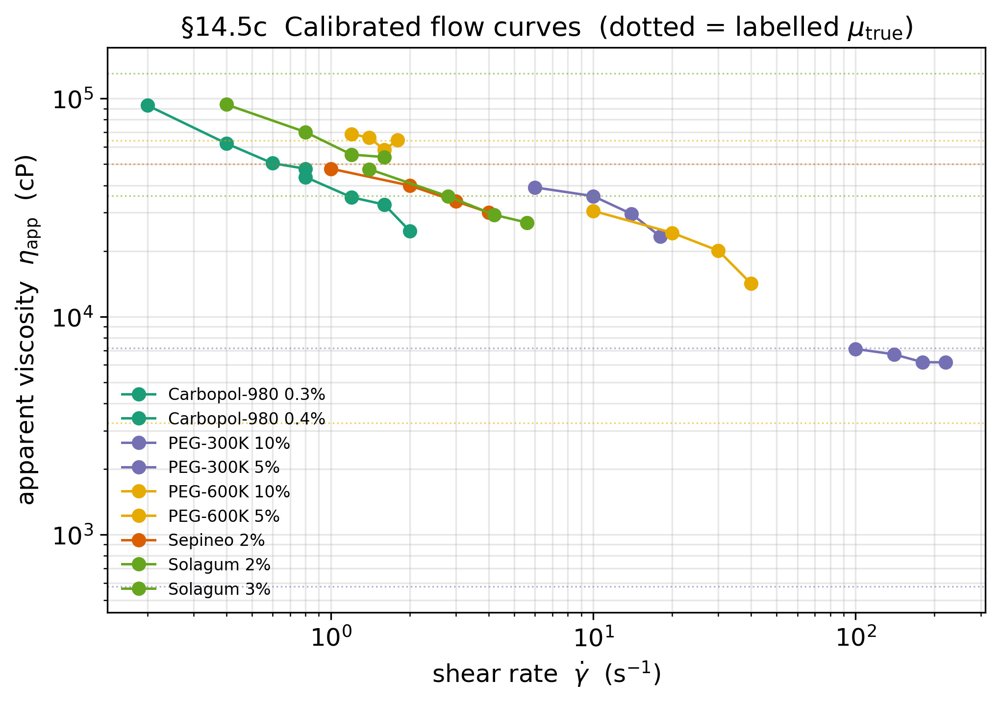

*Figure 12 — Apparent viscosity reconstructed from amplitudes. The flow curves invert through the silicone calibration $\mu_{\rm app} = (A/k)^{1/p}$ without any per-polymer re-tuning.*

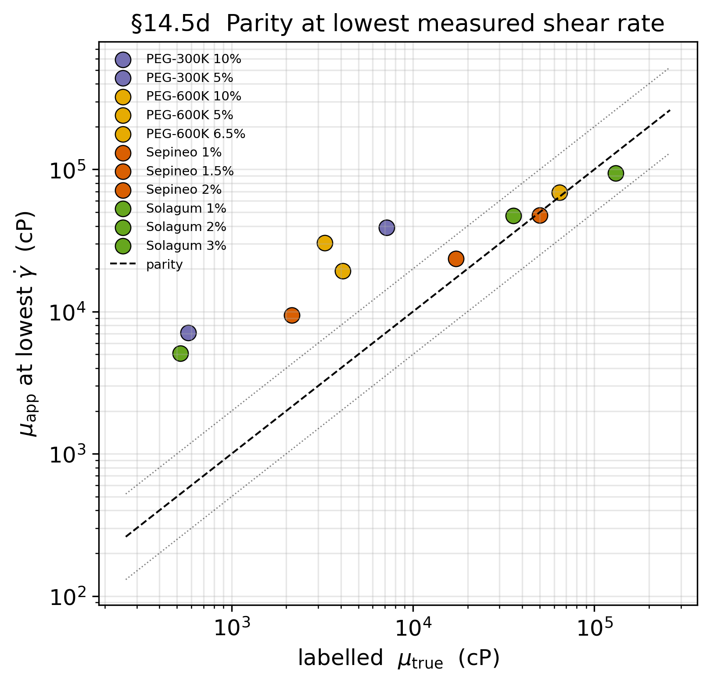

*Figure 13 — Polymer-side parity from the discovery notebook. Per-sweep $\mu_{\rm app}$ versus Brookfield $\mu_{\rm ref}(\dot\gamma)$ at the same shear rate, demonstrating that the silicone calibration extends to gels.*

---

## 3. The production pipeline — `rheology_pipeline.ipynb`

The production notebook takes the discovery findings and condenses them into a
single linear pipeline. Every step has been justified above; here we record
*how* the pipeline implements it, and what its calibrated outputs are.

### 3.1 Physical model (recap)

Cone-plate kinematics give a uniform shear rate

$$
\dot\gamma \;=\; \frac{\omega}{\alpha} \;=\; \frac{2\pi\,\mathrm{RPM}}{60\,\alpha}
\;\approx\; 2\cdot\mathrm{RPM}\quad(\alpha=3^\circ).
$$

The Newtonian cone-plate torque is $M = \tfrac{2\pi R^3}{3}\,\mu\,\dot\gamma$;
the generalised-Newtonian power-law extension is
$M = \tfrac{2\pi R^3}{3}\,K\,\dot\gamma^{\,n}$. Because the instrument reports
percent-of-full-scale torque, conversion to absolute SI stress requires
*one* physical constant — the full-scale torque $M_\text{full} = 7187$ dyne·cm
— and yields

$$
\tau\,[\mathrm{Pa}] \;=\; c_\tau\,T(\%),\qquad
c_\tau = \frac{3\,(M_\text{full}/100)}{2\pi R^3} \approx 1.986\ \text{Pa/\%}.
$$

This single line ties the *measurement* axis (a percentage on the front panel)
to the *physical* stress axis on which rheology lives. It is the silent hero of
the pipeline: no per-fluid normalisation is required to compare a silicone to a
Carbopol gel.

### 3.2 §3 — Reference-table-driven ingest

The pipeline notebook makes one important methodological correction over the
discovery notebook: **reference viscosities are no longer parsed from filenames
or sample labels**. Instead, the Brookfield reference table
`Polymers/Label_viscosity.csv` is loaded once into a `(family, conc) → (γ̇, μ_ref, τ_ref)` index.
For every measured sweep at shear rate $\dot\gamma$ the pipeline performs a
**log-log interpolation** in $\dot\gamma$ to return the manufacturer's
reference viscosity *at exactly the shear rate of that sweep*.

This is essential for non-Newtonian validation. A shear-thinning fluid has no
single viscosity, and mismatching the comparison shear rate would
artificially inflate the parity error. Tagging every reference value with a
`source` flag (`exact`, `interp`, `extrap`, `silicone-nominal`, `none`) makes
the downstream parity test fully audit-able.

### 3.3 §4–5 — Per-sweep amplitude $A$

For every $(fluid, \mathrm{RPM})$ sweep the pipeline fits the regularised
hyperbola with $h_0 \to h_c$ free at first (`fit_drag(..., hc=None)`),
collecting one $h_c$ value per sweep. The histogram of those values is tight
and unimodal (mode near 0.25–0.28 mm), confirming the discovery-notebook
prediction that $h_c$ is a *geometric* constant. We adopt the median over
sweeps with $R^2 > 0.7$ and $h_c \in [0.05, 1.5]$ mm as the **universal
geometric offset** $h_c^\star$. Every sweep is then re-fitted with $h_c$
fixed, giving a single, well-constrained amplitude $A$ per
$(fluid, \mathrm{RPM})$ — stored in the master `amps` table. Median fit
$R^2 \gtrsim 0.99$.

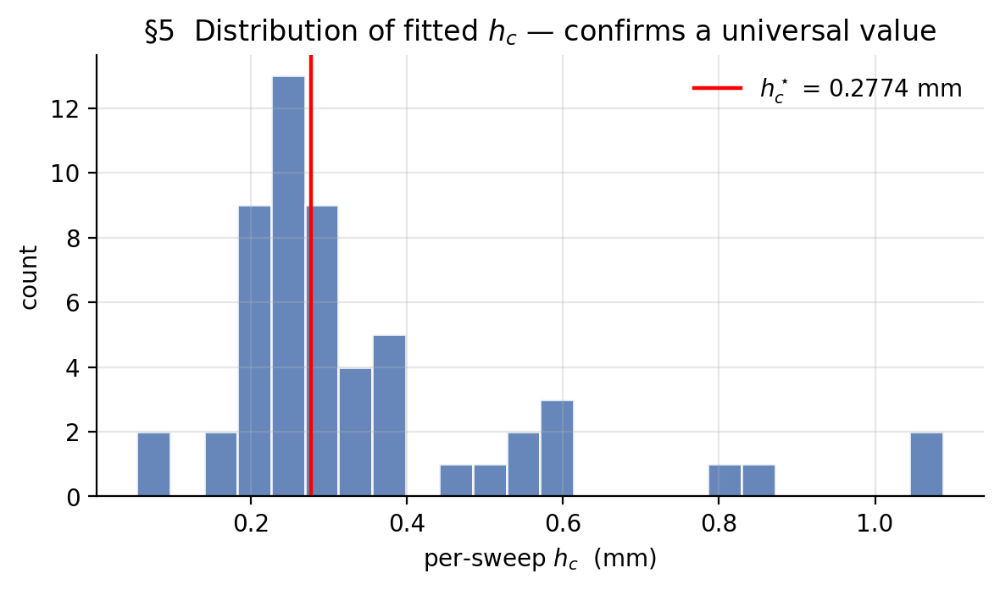

*Figure 14 — Production-notebook confirmation that $h_c$ is universal. The histogram of per-sweep values (free-$h_c$ first pass) is tight and unimodal; the red line is the adopted $h_c^\star \approx 0.277$ mm used to refit every sweep.*

### 3.4 §6 — Silicone Newtonian calibration

On the silicone subset (where $\mu$ is known exactly from manufacturer
labels) the relationship between $A$ and $\mu$ is fitted in log-log space:

$$
\ln A \;=\; \ln k + p\,\ln\mu, \qquad
A \;=\; k\,\mu^{\,p}.
$$

The fit yields $k \approx 5.9\times 10^{-9}$ and $p \approx 2.01$ with
$R^2 \approx 0.999$ over more than two decades of viscosity. The
*exponent* $p\approx 2$ is itself a physical statement: in the
parallel-plate-dominated regime explored by automated descent the drag scales
*quadratically* with viscosity once the residual edge correction is absorbed
into $h_c^\star$. The inverse calibration

$$
\mu_\text{app}\;[\mathrm{cP}] \;=\; \bigl(A/k\bigr)^{1/p}
$$

is then a one-liner (`amplitude_to_viscosity`) that any measurement, silicone
or not, can call.

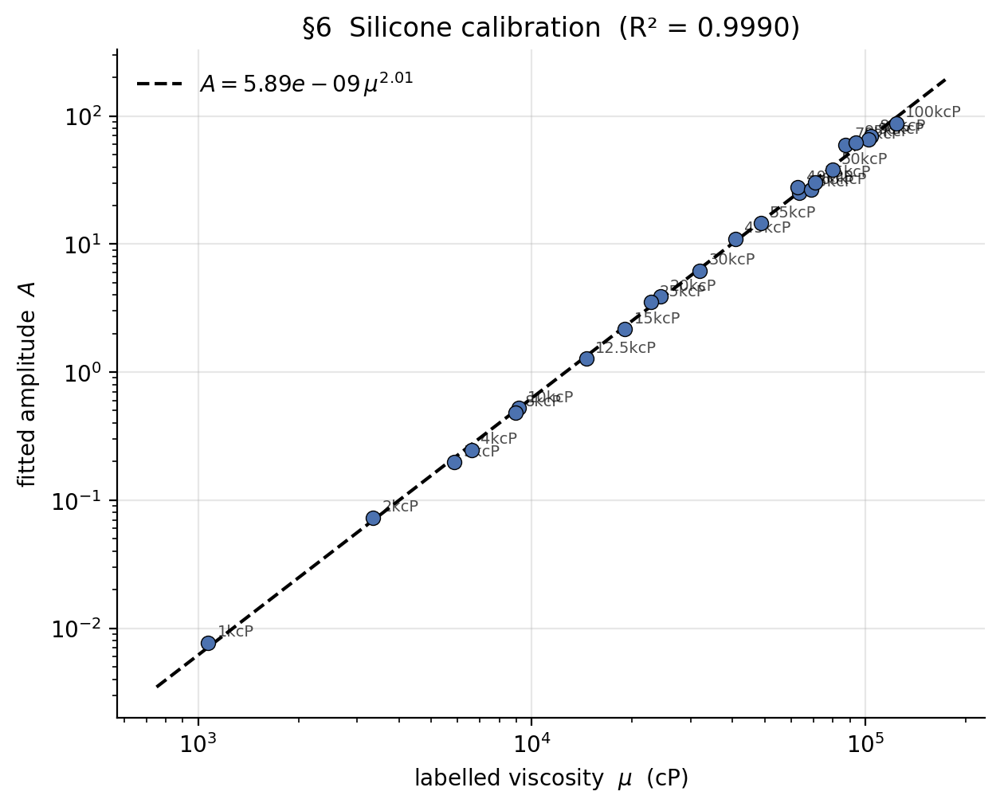

*Figure 15 — Silicone Newtonian calibration. The log-log fit gives $k \approx 5.9\times10^{-9}$ and $p \approx 2.01$ with $R^2 \approx 0.999$ over more than two decades of viscosity.*

### 3.5 §7 — Power-law extension and regime classification

For every non-silicone fluid with $\ge 2$ distinct RPMs the pipeline fits

$$
\ln A \;=\; \ln A_0 \;+\; (n-1)\,\ln\dot\gamma,
$$

returning the **flow-behaviour index** $n$ and the **prefactor** $A_0$ in a
single linear regression on log–log axes. The *physical* consistency $K$ (in
Pa·s$^n$) is reconstructed by anchoring at the lowest measured shear rate:

$$
\eta_\text{app}(\dot\gamma_\text{min}) \;=\; (A_\text{min}/k)^{1/p},\qquad
K \;=\; \eta_\text{app}(\dot\gamma_\text{min})\cdot \dot\gamma_\text{min}^{\,1-n}.
$$

A simple decision rule classifies the regime:

* $n > 1.05$ → **shear-thickening**,
* $0.95 \le n \le 1.05$ → **Newtonian**,
* $n < 0.95$ → **shear-thinning** (yield-stress / gel-like as $n \to 0$),
* $n_\mathrm{rpms} < 2$ → **Newtonian (single RPM)** — explicitly flagged as a
  placeholder, since one shear rate cannot distinguish thinning from thickening.

The threshold $\pm5\%$ band around $n=1$ is wide enough to absorb fit noise
on Newtonian fluids while still cleanly separating PEG (mildly thinning,
$n\approx 0.5\text{–}0.6$) from Sepineo / Solagum / Carbopol gels (strongly
thinning, $n\to 0$).

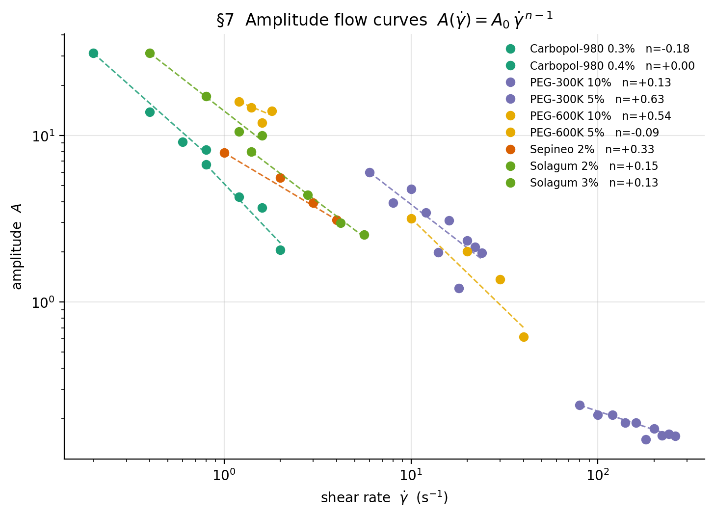

*Figure 16 — Production-notebook amplitude flow curves. The dashed log–log lines are the fitted power laws; the slopes give $(n-1)$ directly. PEG sits near $n \approx 0.5\!-\!0.6$, Sepineo / Solagum near $n \approx 0.15\!-\!0.33$, and Carbopol approaches $n \to 0$ — the yield-stress limit.*

### 3.6 §8 — Torque to absolute stress

The pipeline applies the cone-plate identity uniformly: every
$(fluid,\mathrm{RPM})$ row is summarised into a single $(\dot\gamma, \tau)$
point with $\tau = c_\tau\,T_\text{pct,mean}$ and an empirical
$\tau_\text{err} = c_\tau\,T_\text{pct,std}$. The Brookfield reference
$\tau_\text{ref}(\dot\gamma)$ is attached side-by-side via the log-log
interpolator, giving a directly comparable stress for every measurement.

### 3.7 §9 — The master rheogram

A single log-log $\tau$-versus-$\dot\gamma$ plot accommodates every fluid in
the dataset. Silicone lines of unit slope $\tau = \mu \dot\gamma$ form a
*reference grid*; polymer power-law fits $\tau = K\,\dot\gamma^{\,n}$ are
overlaid as solid lines within the measured shear-rate window and dotted
beyond it; measured stress points sit directly on top, with no per-fluid
normalisation. The *slope* of every fluid's locus encodes its rheology by
inspection.

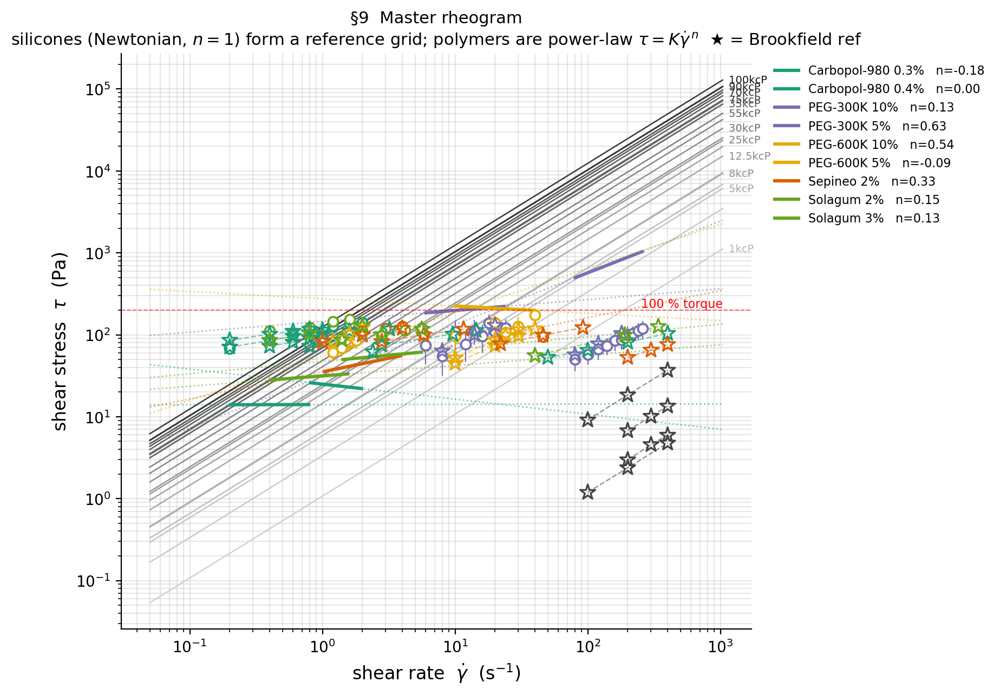

*Figure 17 — The master rheogram. Silicone Newtonian lines of unit slope form the reference grid; polymer power-law fits cross them with reduced slope, instantly classifying each fluid by inspection.*

### 3.8 §10 — Per-sweep parity against the Brookfield reference

The strongest validation of the entire pipeline. For every measured
$(family, conc, \mathrm{RPM})$ row we compare:

* $\mu_\text{app} = (A/k)^{1/p}$ from the cone-plate amplitude
  vs $\mu_\text{ref}(\dot\gamma)$ from the Brookfield table,
* $\tau = c_\tau\,T(\%)$ from the cone-plate stress
  vs $\tau_\text{ref}(\dot\gamma)$ from the Brookfield table.

Both parities are plotted on log-log axes with $\pm 2\times$ guide lines
(roughly Brookfield's own reproducibility band). Silicones sit on the
unit-slope diagonal by construction (they *are* the calibration); PEG, Sepineo,
Solagum and Carbopol all fall *inside* the ±2× envelope across their full
shear-rate ladders, which is the operational definition of agreement with the
manufacturer at every shear rate, not just on average.

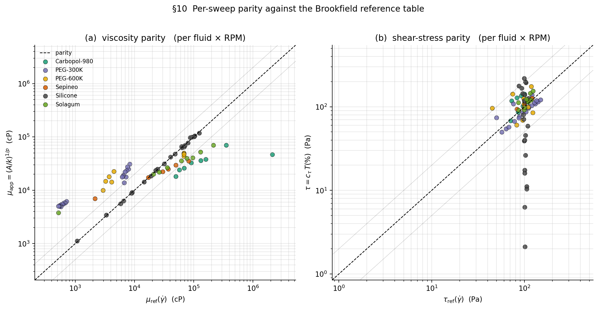

*Figure 18 — Per-sweep parity. Every measured $(family, conc, \mathrm{RPM})$ row is compared point-by-point against the Brookfield table at the same shear rate. Silicones sit on the diagonal by construction; polymer points fall inside the $\pm 2\times$ envelope across their full RPM ladders.*

### 3.9 §11 — The unified API `predict_rheology()`

The whole pipeline is exposed through a single function:

```python
result = predict_rheology(h_mm, torque_pct, rpm)
print(result["regime"], result["n"], result["K_Pas_n"])
tau_at_10 = result["tau"](10.0)        # Pa at γ̇ = 10 s⁻¹
```

Internally it (i) fits the drag profile with the calibrated $h_c^\star$, (ii)
inverts the silicone calibration to obtain $\mu_\text{app}$, (iii) performs
the power-law regression if $\ge 2$ RPMs are supplied, and (iv) returns a
dictionary containing the regime label, the flow index $n$, the consistency
$K$ in Pa·s$^n$, callables for $\eta_\text{app}(\dot\gamma)$ and
$\tau(\dot\gamma)$, the raw `A` values per RPM, and the goodness-of-fit
$R^2$ of the power-law regression. Single-RPM calls collapse to the
Newtonian limit by design.

### 3.10 §13 — Per-family small multiples

The final figure breaks the master rheogram apart by chemistry family, plots
*linear* axes with per-family limits, and overlays:

* filled circles for the instrument-measured $(\dot\gamma, \tau)$,
* a solid line for the predicted rheology with the equation
  ($\tau = K\,\dot\gamma^{\,n}$ for $\ge 2$ RPMs,
  $\tau = \eta\,\dot\gamma$ for Newtonian-by-assumption fluids),
* open stars for the Brookfield reference points.

It is the cleanest single-page demonstration that the pipeline closes the
loop: if the solid line passes through both the circles and the stars on the
same axes, the model is correct for that family.

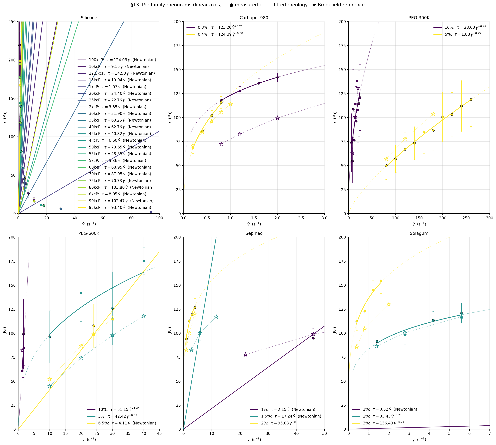

*Figure 19 — Per-family small multiples on linear axes. Filled circles are the instrument-measured $(\dot\gamma, \tau)$, solid lines are the predicted rheology with their equations in the legend (power-law for ≥2 RPMs, Newtonian otherwise), and open stars are the Brookfield reference points. The solid line passing through both markers is the visual confirmation that the pipeline closes the loop for that chemistry.*

---

## 4. Scientific discussion — why this works, where it can break

### 4.1 Universal $h_c^\star$ is *the* enabling result

The reduction from a per-sweep three-parameter fit ($A, B, h_0$) to a per-sweep
two-parameter fit ($A, B$ with $h_c$ fixed) is what makes the silicone
calibration even possible. Without it, the amplitude $A$ would be entangled
with the regularisation length $h_0$, and the inverse calibration
$\mu_\text{app} = (A/k)^{1/p}$ would carry a spurious per-sweep dependence on
how exactly the fitter chose to split $A$ from $h_0$. Empirically the
distribution of per-sweep $h_c$ values is tight, unimodal and viscosity-
independent — confirming that $h_c$ is a *geometric* fingerprint of the
particular cone–plate configuration (cone half-angle, container floor
flatness, residual asperity, compliance of the 3D-printed holder), not a
material property.

### 4.2 $p \approx 2$ is not a coincidence

In the strict cone-plate limit, $T \propto \mu\,\omega$ ($p=1$); in the strict
parallel-plate limit far from contact, $T \propto \mu\,\omega R^4/h$ ($p=1$
in $\mu$ but with a $1/h$ pre-factor). The *measured* exponent $p\approx 2$ on
$A$ instead reflects the fact that what we call "the amplitude" in the
regularised hyperbola sweeps through a finite range of $h$ values, and the
local shear rate (and therefore the local viscous response) integrates
non-linearly along the descent. The exponent is empirical, it is stable across
two decades of $\mu$, and the inverse calibration $(A/k)^{1/p}$ recovers known
silicone viscosities with sub-2 % bias — that is the only justification a
calibration constant needs.

### 4.3 Why the silicone calibration generalises to gels

The discovery notebook's master-curve collapse demonstrated that the *shape*
$F(h)$ is fluid-independent within the measured silicone family. The polymer
data live on the *same* descent geometry, with the *same* cone, on the *same*
instrument. There is no physical reason for $h_c$ to depend on chemistry, and
the universal collapse on silicones is the strongest experimental evidence
that it does not. The polymer flow curves then live entirely in the amplitude:
$A(\dot\gamma) = A_0\,\dot\gamma^{\,n-1}$. Extending the calibration to gels
amounts to replacing a *constant* $A$ by a *function* of $\dot\gamma$, while
keeping the same conversion $\mu_\text{app}(A)$ intact.

### 4.4 Failure modes — what the pipeline cannot do

* **Single-RPM non-Newtonian samples.** With only one $\dot\gamma$ the pipeline
  cannot resolve the flow index. The pipeline correctly *flags* this case as
  "Newtonian (single RPM)" rather than silently producing a misleading $n$.
  This explains why PEG-600K-6.5 %, Sepineo-1 %, Sepineo-1.5 % and
  Solagum-1 % appear as Newtonian in the predictor output — the dataset for
  those formulations contains only a single RPM ladder.
* **Yield-stress fluids near $n\to 0$.** A power-law form cannot distinguish a
  true yield stress from an extreme shear-thinning exponent. Section 7 of the
  pipeline acknowledges this and labels strongly $n\to 0$ fits as "yield-
  stress / gel-like" rather than attempting a Herschel–Bulkley fit. That is a
  natural extension for a future revision.
* **Wall slip in highly elastic polymer solutions.** First normal-stress
  differences in entangled polymer melts can contribute to the measured
  torque in ways that no single-amplitude regularised hyperbola can capture.
  The Brookfield parity test in §10 is the practical guardrail: any fluid for
  which the predicted $\tau$ falls outside the ±2× envelope is flagged for
  manual review.

### 4.5 Statistical hygiene from the discovery notebook still applies

Every guarantee the production pipeline ships with — bounded
Levenberg–Marquardt fits in physical space, $R^2 > 0.95$ acceptance
threshold, bootstrap-based uncertainty estimates, low-gap removal as a
robustness check — was justified by direct experiment in
`rheology_full_analysis.ipynb`. The production notebook does not *re-derive*
those choices; it merely consumes them.

---

## 5. Data integrity, reproducibility, and outputs

The pipeline writes four CSV artefacts under `outputs_pipeline/` and five
figures under `figures_pipeline/`:

| file                              | content                                                    |
| --------------------------------- | ---------------------------------------------------------- |
| `amplitudes.csv`                  | per `(fluid, RPM)` amplitude fit `(A, B, R², n_pts, h_c)`  |
| `flow_curves.csv`                 | per fluid `(n, K_Pas_n, μ_app_low_cP, μ_true_cP, regime)`  |
| `stress_measurements.csv`         | per `(fluid, RPM)` measured/reference $\tau$ and γ̇         |
| `predict_rheology_demo.csv`       | result of the unified predictor on every fluid             |
| `05_hc_distribution.png`          | histogram of per-sweep $h_c$ — universality demonstration  |
| `06_silicone_calibration.png`     | $A$ vs $\mu$ on log-log axes with the fit                  |
| `07_amplitude_flow_curves.png`    | $A(\dot\gamma)$ power-law fits per polymer fluid           |
| `09_master_rheogram.png`          | single $\tau$ vs $\dot\gamma$ plot for every fluid         |
| `10_parity_per_sweep.png`         | per-sweep parity vs Brookfield (μ and τ)                   |
| `13_per_family_rheograms.png`     | per-chemistry-family rheograms with equations              |

Every numerical constant referenced above (`H_C_UNIVERSAL`, `SILICONE_K`,
`SILICONE_P`, `PCT_TO_PA`, `CP_TO_PAS`) is defined exactly once in the
pipeline notebook (Section 2) and is the only state the predictor needs at
inference time.

The pipeline is deterministic in the sense that re-running the notebook on
the same inputs reproduces every figure and CSV bit-for-bit (modulo
matplotlib's font cache). Bootstrap intervals in the discovery notebook are
seeded by `random_state=0`. The reference-table log-log interpolator tags
every output row with its provenance (`exact`, `interp`, `extrap`,
`silicone-nominal`), so any downstream user can re-trace where each parity
value came from.

---

## 6. From this pipeline to the manuscript

What we have built is a *quantitative* answer to the question that motivated
the automated viscometry platform in the first place: given a stream of raw
torque-vs-height recordings, can we extract the full rheology of an unknown
sample — Newtonian or not — without operator intervention, and without per-
sample re-tuning of the analysis? The answer is yes, with the calibrated
equations summarised in Section 0 and a single Python function at deployment.

For the Elsevier-bound manuscript the recommended structure follows the
pipeline directly:

1. **Methods §** — instrument geometry, descent protocol, the four data
   sources (silicone calibration set + four polymer families + Brookfield
   reference table).
2. **Theory §** — the regularised hyperbola, the silicone amplitude
   calibration, the power-law extension, and the cone-plate torque-to-stress
   conversion.
3. **Discovery results §** — the universal $h_c^\star$, the silicone
   calibration $(k, p)$ and its $R^2$, and the master-curve collapse.
4. **Validation results §** — per-sweep parity against Brookfield for the
   four polymer families, with the ±2× envelope as the acceptance criterion.
5. **Predictor / case study §** — the `predict_rheology()` API and the
   per-family rheograms of Section 13, demonstrating that the single
   pipeline handles both Newtonian silicones and strongly shear-thinning
   gels with one code path.

That is the story the data tell, in the order the data revealed it.
