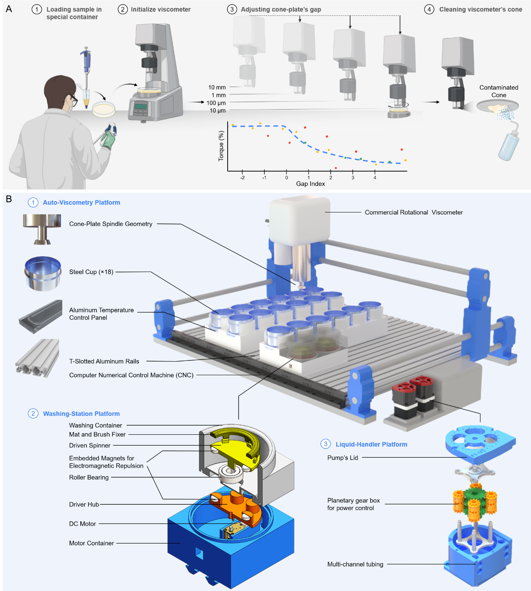
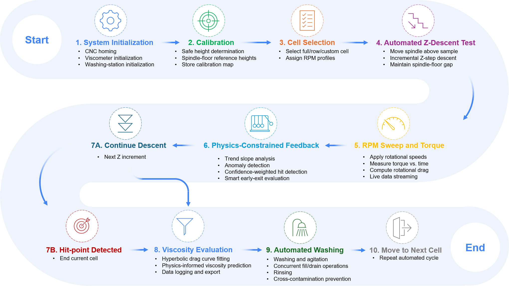
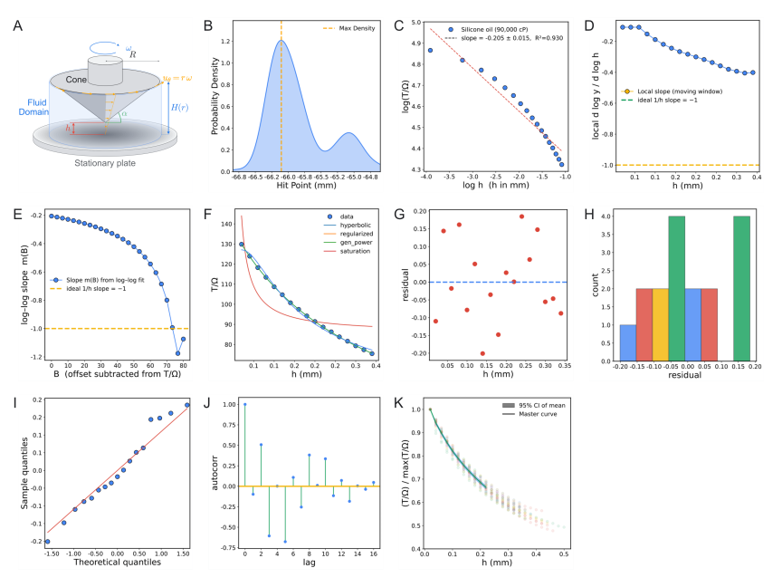
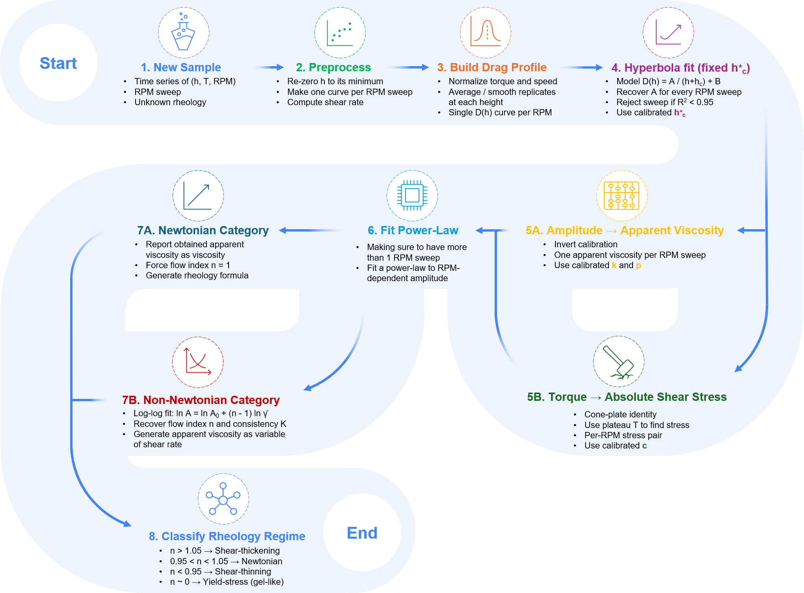
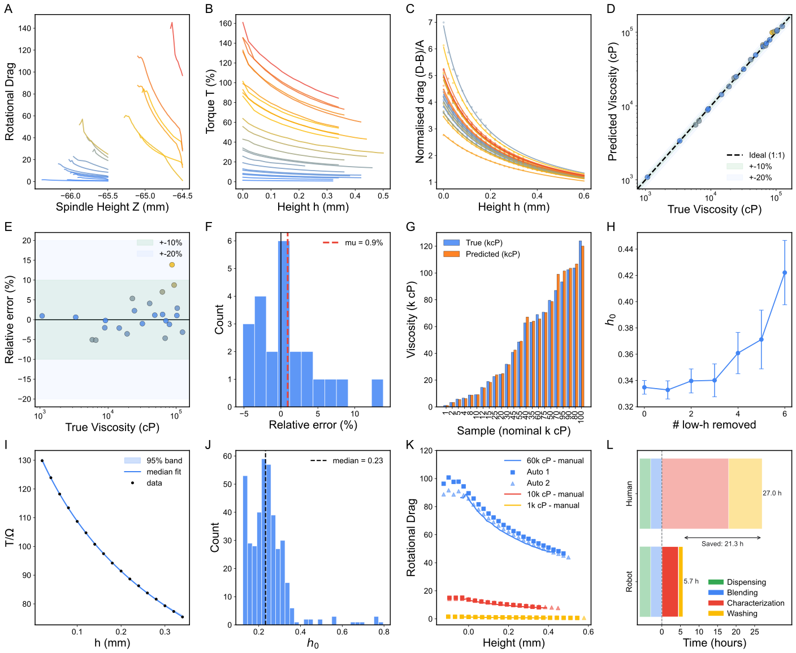
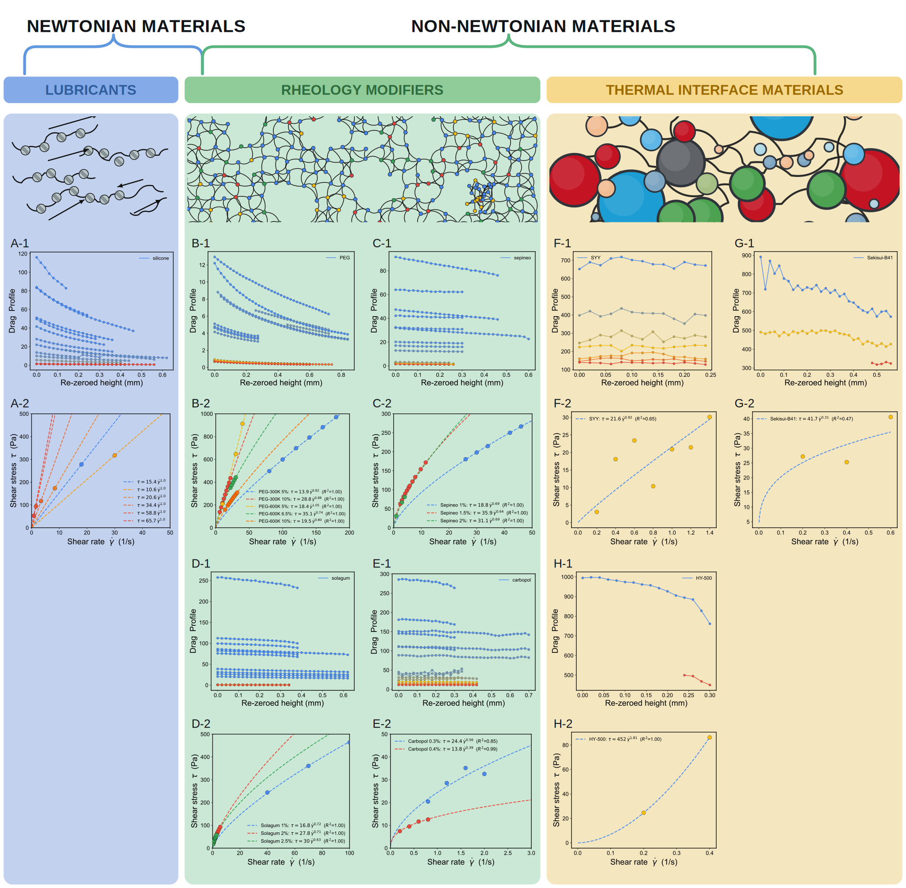
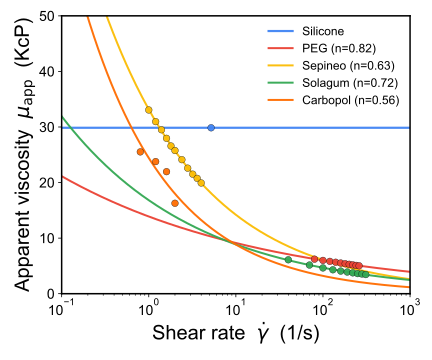
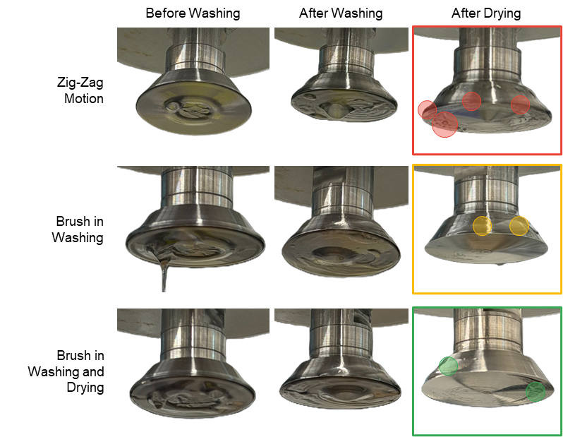
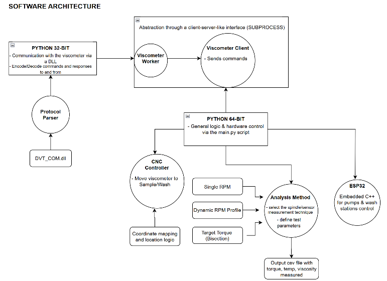

# **Autonomous Rheology Discovery for High-Viscosity Formulation Screening via Physics-Constrained Signal Interpretation**

Mohammad M Rastegardoosta, Ian Ngungab, Koketso Gaborekwec, Frantz Le Devedeca

# Abstract

The rheological characterization of high-viscosity fluids is a recognized bottleneck in formulation science: manual cone-and-plate or parallel-plate measurements impose gap-setting and zero-point tolerances at the tens-of-micrometre scale ([Laun *et al.*, 2014](https://doi.org/10.1515/pac-2013-0601); [Macosko, 1994](https://www.wiley.com/en-us/Rheology:+Principles,+Measurements,+and+Applications-p-9780471185758)), a geometric-precision requirement that is fundamentally incompatible with robotic execution. We present an automated viscometry platform that reframes viscosity acquisition as a signal-interpretation problem rather than a geometric-precision problem, extending the physics-informed inference paradigm that has reshaped inverse-problem solving elsewhere in engineering and the physical sciences ([Karniadakis *et al.*, 2021](https://doi.org/10.1038/s42254-021-00314-5); [Raissi *et al.*, 2019](https://doi.org/10.1016/j.jcp.2018.10.045)) to a robotic sensing instrument. A cone-shaped rotational torquemeter is coupled to a Cartesian motion stage, an automated dual-stage washing module, and an asynchronous, multi-runtime control architecture; the descent of the spindle generates torque–displacement signatures that are decoded through a physics-constrained inference pipeline calibrated only once on a Newtonian silicone reference set. The pipeline reduces every raw descent to a calibrated stress–shear-rate curve and, for fluids measured at multiple rotation rates, returns the fitted power-law constitutive equation τ = Kγ̇n directly. **Across six mechanistically distinct chemistries spanning five orders of magnitude in viscosity (1–125,000 cP)** — silicone oils, polyethylene glycol, glycerol, polysaccharide gums, associative polymeric thickeners, and crosslinked microgels — the platform recovers the manufacturer-quoted apparent viscosity within a ±2× envelope across the full shear-rate ladder, classifies Newtonian / shear-thinning / yield-stress regimes from the recovered flow-behaviour index n, and **processes 18 samples within a five-hour autonomous run using fewer than 20 minutes — under 7% of total run time — of direct human involvement**. The two main outputs of the system — a calibrated stress–shear-rate flow curve and the fitted power-law constitutive equation — are obtained from a single pass through a universal analysis pipeline with no per-chemistry retuning, demonstrating that an information-rich automated workflow can substitute for the precision hardware of conventional rotational rheometry. Beyond its standalone characterization performance, the platform is positioned as the foundational measurement layer of forthcoming rheology-discovery campaigns, in which Bayesian optimization and batch-wise active learning — approaches already shown to cut experiment counts by up to an order of magnitude in adjacent reaction- and materials-discovery settings ([Shields *et al.*, 2021](https://doi.org/10.1038/s41586-021-03213-y); [Kusne *et al.*, 2020](https://doi.org/10.1038/s41467-020-19597-w)) — will propose formulations and processing conditions, the proposed samples will be characterized autonomously through this platform, and the recovered flow curves and constitutive coefficients will be fed back into the machine-learning loop to drive closed-loop material discovery across multi-component composition spaces.

**Keyword:** automated rheology, cone-and-plate viscometry, torque–displacement, physics-constrained inference, power-law fluids, self-driving laboratory, Bayesian optimization, active learning, material discovery, high-throughput characterization.

# 1. Introduction

The systematic mapping of viscosity in the 1,000–125,000 cP regime underpins the development of lubricants [[1]](https://doi.org/10.1007/s11249-018-1007-0), specialty coatings [[2]](https://doi.org/10.1016/j.porgcoat.2016.07.016)[[3]](https://doi.org/10.1016/j.porgcoat.2021.106139), pharmaceutical excipients and injectable formulations [[4]](https://doi.org/10.1016/j.ijpharm.2018.11.012), personal-care emulsions [[5]](https://doi.org/10.1007/s13367-024-00108-y)[[6]](https://doi.org/10.3390/cosmetics12020076), and advanced adhesives [[7]](https://doi.org/10.1016/j.ijadhadh.2012.10.011), where the rheological response is the dominant property determining processability, stability, and end-use performance. In these regimes, formulation spaces are typically explored across binary, ternary, or higher-order composition spaces in which viscosity evolves logarithmically and highly non-linearly with composition, so that resolving even a single property landscape can demand hundreds of independent measurements. Manual rotational rheometry, however, is fundamentally limited by its dependence on operator-controlled gap setting, sample loading, cleaning, and sequence pacing: international metrology guidelines for rotational rheometers specify gap-setting and zero-point tolerances at the tens-of-micrometre scale precisely because the recorded torque is exquisitely sensitive to this single geometric parameter [[8]](https://doi.org/10.1515/pac-2013-0601), a precision that a trained operator can maintain by feel and repetition [[9]](https://www.wiley.com/en-us/Rheology:+Principles,+Measurements,+and+Applications-p-9780471185758) but that an unmodified robotic stage, as we show below, cannot. The cumulative human time required to characterize even a modest design of experiments routinely exceeds days of skilled labour, and the inter-operator variance introduced at every step degrades the comparability of measurements collected across different sessions. The combination of long cycle times, operator dependency, and the structural impracticality of multi-component sweeps therefore constitutes a recognized bottleneck that has limited the experimental cadence of formulation development for decades.

A natural response to this bottleneck has been to substitute experimentation with empirical mixing models. The logarithmic blending rule, the Grunberg–Nissan equation [[10]](https://www.nature.com/articles/164799b0), the Ramírez-de-Santiago model [[11]](https://doi.org/10.1021/acs.iecr.4c03240), and the Redlich–Kister polynomial framework [[12]](https://doi.org/10.1021/ie50458a036) are widely used to interpolate or extrapolate the viscosity of multi-component mixtures from a small number of pure-component or binary references. These models are quantitatively accurate in the dilute, near-ideal regimes for which they were originally calibrated [[13]](https://doi.org/10.1007/s10765-011-1100-1), but systematic benchmarking against real hydrocarbon, petroleum, and polymer-solvent mixtures shows that they break down at the concentration extremes and viscosity ranges that are most relevant industrially [[14]](https://doi.org/10.3389/fenrg.2022.1074699)[[15]](https://doi.org/10.1021/ie060429k): hydrogen-bonding networks, associative interactions, polymer-chain entanglement, and microgel structuring all produce non-ideal behaviour that the empirical kernels cannot represent [[16]](https://doi.org/10.1016/j.fuel.2011.01.017)[[17]](https://doi.org/10.1021/acs.iecr.2c01487). As a result, even well-parameterized models routinely incur absolute-viscosity errors in excess of 50% for ternary systems above 10,000 cP, and the absence of a reliable computational surrogate places physical ground-truth measurement back at the centre of any rigorous formulation programme. The accelerating convergence of experimental and computational workflows therefore depends on reducing the cost of the measurement itself, not on eliminating it.

The closed-loop integration of robotic sample handling, automated characterization, and machine-learning-guided decision making — collectively termed self-driving laboratories [[18]](https://doi.org/10.1038/s44160-022-00231-0)[[19]](https://doi.org/10.1021/acs.chemrev.4c00055) — has emerged as a pragmatic solution to this measurement-cost problem. Autonomous platforms combining robotic synthesis, in-line characterization, and sequential decision-making have compressed development cycles from years to weeks in organic synthesis and reaction optimization [[20]](https://doi.org/10.1038/s41586-020-2442-2)[[21]](https://doi.org/10.1126/science.aax1566)[[22]](https://doi.org/10.1038/s41586-023-06734-w)[[23]](https://doi.org/10.1126/science.aav2211)[[24]](https://doi.org/10.1038/s41586-018-0307-8)[[25]](https://doi.org/10.1038/ncomms15733), thin-film and quantum-dot materials discovery [[26]](https://doi.org/10.1126/sciadv.aaz8867)[[27]](https://doi.org/10.1002/adma.202001626), perovskite photovoltaic absorber screening [[28]](https://doi.org/10.1016/j.joule.2019.05.014), heterogeneous catalyst optimization [[29]](https://doi.org/10.1038/s41586-020-2242-8)[[30]](https://doi.org/10.1016/j.checat.2023.100888), and polymer processing-condition discovery [[31]](https://doi.org/10.1038/s41467-024-55655-3), most recently extending to fully mobile robots that navigate a conventional wet lab and select their own sequence of experiments [[32]](https://doi.org/10.1038/s41586-024-08173-7). A community perspective on these efforts converges on the same observation: the rate-limiting step of autonomous experimentation is rarely the decision-making algorithm — Bayesian optimization and active-learning strategies already navigate reaction and composition spaces with severalfold fewer experiments than grid or random search [[33]](https://doi.org/10.1038/s41586-021-03213-y)[[34]](https://doi.org/10.1038/s41467-020-19597-w)[[35]](https://doi.org/10.1038/s41467-023-37139-y)[[36]](https://doi.org/10.1039/C9SC05999G)[[37]](https://doi.org/10.1126/sciadv.abg4930)[[38]](https://doi.org/10.1021/acscentsci.8b00307) — but rather the availability of an automatable, information-rich characterization step that can keep pace with the proposal engine [[39]](https://doi.org/10.1016/j.matt.2021.06.036)[[40]](https://doi.org/10.1038/s41578-023-00588-4). Rheology, by contrast, remains conspicuously underrepresented in this literature, because automating a rotational viscometer demands a combination of capabilities that few platforms simultaneously possess: sub-millimetre and repeatable spindle positioning across a multi-cell deck, reliable handling and dispensing of fluids with viscosities spanning more than two orders of magnitude, contamination-free sequential measurement of chemically dissimilar formulations, and an analysis layer that can convert the raw output of an imperfect robotic system into rheological descriptors of comparable fidelity to those obtained on a precision benchtop instrument. The intersection of these requirements has, until now, restricted automated rheology to either narrow viscosity ranges, single-chemistry case studies, or workflows in which the human operator remains in the critical path.

Closing this gap requires shifting the burden of precision from the hardware to the analysis pipeline, an approach with clear precedent in the broader physics-informed machine-learning literature, where embedding known governing equations into a data-driven inference layer has repeatedly proven able to absorb the noise, bias, and incompleteness of imperfect sensors and simulations [[41]](https://doi.org/10.1016/j.jcp.2018.10.045)[[42]](https://doi.org/10.1038/s42254-021-00314-5)[[43]](https://doi.org/10.1109/TKDE.2017.2720168)[[44]](https://doi.org/10.1017/S0962492919000059)[[45]](https://doi.org/10.1098/rsta.2020.0093)[[46]](https://doi.org/10.1007/s10915-022-01939-z)[[47]](https://doi.org/10.1145/3514228), and that now underlies physics-grounded digital twins of mechanical and aerospace hardware [[48]](https://doi.org/10.1038/s43588-024-00613-8). If the descent of the spindle is sampled densely enough, the resulting torque–displacement signature is information-rich: the shape of the rotational drag versus the spindle-to-floor gap encodes the viscosity through a hyperbolic dependence whose amplitude is invertible to an apparent viscosity, while the residual dependence on rotation rate at a fixed gap encodes the flow-behaviour index of the constitutive law that separates Newtonian, shear-thinning power-law [[49]](https://doi.org/10.3390/polym14061262), and yield-stress [[50]](https://doi.org/10.1016/S0377-0257(98)00094-9)[[51]](https://doi.org/10.1007/BF01432034) regimes — the same regimes that govern the associative-network breakdown of polymeric thickeners [[52]](https://doi.org/10.1016/S1359-0294(97)80088-X) and the jamming transitions of crosslinked microgels [[53]](https://doi.org/10.1038/s41467-020-17774-5)[[54]](https://doi.org/10.1016/0095-8522(65)90022-X) that dominate the industrially relevant end of the viscosity scale. A physics-constrained inference framework can extract both descriptors from a single automated descent without relying on the absolute geometric accuracy of the robotic stage, provided the framework is calibrated once on a Newtonian reference set and applied without modification to subsequent samples. Such a framework converts the two long-standing weaknesses of robotic rheometry — backlash-limited positioning and the absence of an operator-tuned gap — into auxiliary nuisance parameters that the data analysis simply absorbs.

In this work we develop, validate, and characterize an end-to-end automated viscometry platform whose explicit objective is to deliver, for any high-viscosity fluid loaded into one of its sample cells, two quantitative outputs: (i) a calibrated stress–shear-rate flow curve, and (ii) the fitted power-law constitutive equation τ = Kγ̇n that summarizes the rheological regime of the sample. The contributions of the work are organized along three complementary axes. From a mechanical-engineering perspective, we designed and integrated the Cartesian motion stage, the cone-shaped rotational torquemeter, and the magnetically-driven dual-stage washing station into a single workstation capable of executing fully autonomous measurement and cleaning cycles across a multi-cell sample deck under a unified asynchronous control plane. From a physics and data science perspective, we treat the descent of the spindle as a physically structured signal rather than a single-point measurement: a generalized lubrication-theory framework is used to constrain the functional form of the rotational drag, and a data-driven inference layer fitted on top of that physics absorbs the residual mechanical and geometric uncertainties of the robotic stage into nuisance parameters, so that the calibrated apparent viscosity and the flow-behaviour index are recovered directly from the raw torque–displacement signature without per-chemistry retuning — reducing a measurement problem historically defined by micrometre-scale mechanical tolerance to one defined by signal-processing fidelity. From an autonomous-experimentation perspective, we transferred this single, one-shot calibration without modification across six mechanistically distinct chemistries spanning five orders of magnitude in viscosity (1–125,000 cP) — silicone oils, polyethylene glycol, glycerol, polysaccharide gums, associative thickeners, and crosslinked microgels — and verified that it reproduces the manufacturer-quoted reference rheology within a ±2× envelope across the full shear-rate ladder and correctly classifies the Newtonian, shear-thinning, and yield-stress regimes of every calibration and validation fluid, while completing 18-sample runs in approximately five hours of robot time, of which fewer than 20 minutes — under 7% of total run time — require direct human involvement, a throughput and labour profile that manual cone-and-plate rheometry cannot match at comparable measurement density. Taken together, these three contributions demonstrate, at the level of a single instrument, the same principle that has driven self-driving laboratories elsewhere in the physical sciences: an information-rich, physics-constrained analysis layer can substitute for the precision hardware and constant operator attention of conventional measurement, establishing the platform as the foundational measurement layer of forthcoming rheology-discovery campaigns, in which Bayesian optimization and batch-wise active learning — approaches that have already cut experiment counts by up to an order of magnitude in analogous reaction- and materials-discovery settings [[33]](https://doi.org/10.1038/s41586-021-03213-y)[[35]](https://doi.org/10.1038/s41467-023-37139-y) — will propose new formulations and processing conditions, the resulting samples will be characterized autonomously through the platform, and the recovered flow curves and constitutive coefficients will be fed back into the machine-learning loop to drive closed-loop material discovery across multi-component composition spaces, converting rheological characterization from a bespoke, manual bottleneck into an autonomous, scalable, and machine-learning-ready measurement layer.

**Figure 1.** (A) Manual rheology-data acquisition procedure (Biorender.com). (B) Schematic of the automated viscometry platform showing the Cartesian motion stage, the cone-shaped rotational torquemeter, the multi-cell sample deck, and the integrated dual-stage washing station.

# 2. Methods

Every measurement modality in rheology answers a different question about how a material moves, so the choice of modality is itself a design decision with direct consequences for automatability. Rheology spans extensional, oscillatory, and steady-shear deformation, each yielding a distinct descriptor (**Table 1**), but this work targets steady-state shear rheology acquired through a rotational, torque-based measurement for three converging reasons: it is (i) directly automatable on a Cartesian motion stage, (ii) sufficient to recover both the Newtonian apparent viscosity and the power-law exponent that classifies the dominant non-Newtonian regimes encountered in industrial formulations, and (iii) compatible with the dimensional footprint of a multi-cell sample deck. A manual execution of this modality reduces to three operator-controlled steps — loading the sample into a flat-bottom cell, aligning the spindle precisely against the cell floor, and acquiring torque under a programmed angular velocity — and it is exactly these three steps, in that order, that the platform described below replaces with closed-loop, physics-constrained automation.

**Table 1.** Rheology Principles and Methods

|  |  |  |
| --- | --- | --- |
| Category | Principle/Method | Key Metric |
| Deformation Type | Shear Rheology | Shear Stress, Shear Rate |
|  | Extensional Rheology | Extensional Viscosity |
| Flow Regime | Steady-state Flow | Apparent Viscosity |
|  | Oscillatory (Dynamic) | Storage (G') & Loss (G'') Moduli |
| Measurement Method | Rotational (Torque-Based) | Torque-Displacement |
|  | Capillary/Pipe Flow | Pressure Drop |
|  | Microfluidics | Shear-thinning profiles |
| Material Response | Newtonian | Linear Stress-Strain relationship |
|  | Non-Newtonian | Power-law index |
|  | Viscoelastic | Phase Angle |

## 2.1 Hardware Architecture and Automated Workflow

The complete bill of materials is summarized in **Table S1**, and the integrated layout appears in **Figure 1**. Sample containers are stainless-steel, flat-bottom, high-clearance cylinders, chosen for their resistance to deformation under the vertical loads imposed during near-contact descent; they sit in a modular workstation built from T-slotted aluminium rails (McMaster) with custom container holders fabricated by Fused Deposition Modeling (FDM) in PETG filament. The rotational sensing element is a 3°-cone-angle, 12.0 mm-diameter stainless-steel spindle coupled to a precision rotational torquemeter (AMETEK Brookfield; full-scale torque Mfull = 7187 dyne·cm) — referred to throughout the remainder of the manuscript simply as the rotational torquemeter, with its quoted manufacturer flow curves referred to as the reference rheology. Three-axis programmable motion is supplied by a Cartesian CNC stage (Genmitsu 4040-PRO, SainSmart) actuated by NEMA 17 stepper motors and T10 lead screws, and dedicated peristaltic pumps (Chi.Bio, University of Oxford) meter the cleaning fluids of the integrated washing station.

The single hardest problem in automating cone-and-plate rheometry is not the measurement itself but what happens immediately afterward: a spindle contaminated by the previous sample corrupts every measurement that follows it. A dedicated washing station is therefore integrated into the workstation to clean the spindle after every characterization cycle and eliminate cross-contamination between sequential samples. The station runs on a bespoke magnetic-repulsion drive, in which a motor-driven driving spinner — embedded with magnets and housed in a PETG container — actuates a driven spinner inside a separate, chemically-resistant SLA washing vessel (Rigid 10K Resin V1, Formlabs); the two spinners are separated by a 3.0 mm gap and rotate through magnetic repulsion between inversely arranged poles, so the motor electronics never contact the cleaning fluids. The spindle is cleaned by relative motion against a smooth mat on the driven spinner while detergent, water, and isopropanol are sequenced through the peristaltic pumps. We benchmarked four washing protocols of progressively increasing mechanical complexity — a static spindle held against a rotating spinner, synchronous co-rotation of both spinners, lateral zig-zag oscillation across the cleaning mat, and a multi-modal protocol combining spindle rotation, lateral oscillation, and a brush-fitted spinner — and only the last configuration left no detectable high-viscosity residue at the cone perimeter. This augmented mechanical-scrubbing protocol was therefore adopted as the platform default and is executed concurrently with the CNC travel motions, keeping the washing time off the critical path of the experimental cycle.

**Figure 2** summarizes the full process workflow. After system initialization and per-cell calibration of the safe spindle-to-container reference height, the platform runs an automated per-cell characterization cycle in which the spindle descends incrementally toward the container floor while torque is recorded continuously under a programmed RPM sweep. A physics-constrained feedback layer governs this descent, combining rotational-drag tracking, statistical trend analysis, confidence-weighted hit-point detection, and second-derivative anomaly detection to identify the liquid-contact transition and the optimal termination point of the descent while protecting the sensor from torque overload. Each measurement ends with a two-stage washing sequence launched concurrently with the CNC travel to the next cell, and the resulting torque–displacement record is handed to the analysis pipeline. Robotic positioning, torque-based rheometry, physics-informed feedback, autonomous washing, and real-time data orchestration together form a single closed loop that runs operator-free for the duration of the run.

**Figure 2.** Full workflow of the automated viscometry platform. CNC-controlled positioning, torque-based rotational rheometry, physics-informed descent feedback, autonomous hit-point detection, predictive viscosity estimation, and concurrent washing operations form a unified high-throughput experimental loop.

## 2.2 Physics-Informed Rheological Framework

The platform operates as a modified cone-and-plate configuration in which the cone spindle approaches a stationary plate while torque is monitored as a function of vertical displacement. An automated descent, unlike a manual one, inevitably sweeps a far wider gap range than a human operator would ever program, so the torque trace does not stay within a single hydrodynamic regime: it samples parallel-plate-dominated, transition, and cone-and-plate-dominated behaviour in succession, and no single closed-form solution captures all three at once. We therefore adopt a generalized lubrication-theory framework, in the classical tradition of cone-and-plate and parallel-plate rotational rheometry [[9]](https://www.wiley.com/en-us/Rheology:+Principles,+Measurements,+and+Applications-p-9780471185758), that interpolates continuously between the two asymptotic limits (**Fig. 3A**).

The local liquid thickness between the rotating cone and the stationary plate is

$$H(r) = h + r\tan\alpha \tag{1}$$

where h is the minimum tip clearance, r is the radial coordinate, and α is the cone half-angle. For large spindle separations (h ≫ r tan(α)), the gap thickness becomes nearly uniform throughout the radius (H(r) = h). In this regime, the system approaches classical parallel-plate rotational rheometry, where the torque scales approximately as:

$$T \propto \frac{\mu\omega R^4}{h} \tag{2}$$

Here, the viscous resistance is strongly governed by the global spindle-to-substrate distance. Conversely, for very small clearances (h→0), the radial contribution dominates the gap profile (H(r) ≈ r tan(α)) and the system converges toward the classical cone-and-plate rheometer limit with nearly uniform shear rate across the radius. The analytical torque expression becomes:

$$T = \frac{2\pi}{3}\frac{\mu\omega R^3}{\tan\alpha} \tag{3}$$

Between these two asymptotic limits lies a transition regime in which the finite tip clearance and the cone geometry jointly set the shear field, and neither the parallel-plate approximation nor the ideal cone-and-plate solution describes it accurately on its own. A generalized lubrication-theory framework was therefore used to capture the evolution of shear stress and torque continuously across the entire displacement range.

Under incompressible, laminar, axisymmetric, low-Reynolds-number conditions, the dominant fluid motion is azimuthal, and radial and axial inertia are neglected, so the governing momentum equation reduces to:

$$\mu\frac{\partial^2 u_\theta}{\partial z^2} = 0 \tag{4}$$

Using no-slip boundary conditions at the rotating cone and stationary plate, the azimuthal velocity distribution becomes:

$$u_\theta(r,z) = \frac{\omega r\, z}{H(r)} \tag{5}$$

which yields the local shear stress:

$$\tau(r) = \mu\frac{\omega r}{H(r)} \tag{6}$$

The total torque was then obtained through radial integration of the local viscous moment contributions:

$$T = 2\pi\mu\omega\int_0^R \frac{r^3}{H(r)}\,dr \tag{7}$$

**Equation 7** provides a unified, physics-informed descriptor that is continuous across the parallel-plate, transition, and cone-and-plate regimes traversed by the automated descent.

Moving from manual to autonomous rheometry does not remove the platform's dependence on gap height — it relocates the burden of controlling it. The Cartesian stage is built around NEMA 17 stepper motors and T10 lead screws with a manufacturer-quoted running accuracy of ±0.01 mm, yet cumulative mechanical uncertainties — backlash, thermal expansion of the metallic guides during continuous operation, and the structural compliance of the 3D-printed PETG fixtures — can push the effective positional variance to nearly 0.1 mm in the worst case (**Fig.3B**), an order of magnitude beyond the nominal specification. Rather than chase this uncertainty at the hardware level, we exploit the physical structure encoded in equations (1)–(7): because the shape of the torque-versus-gap signature is a strong function of fluid viscosity, a real-time, feedback-driven analysis of the descent can detect both the liquid-contact transition and the safe termination point of the motion without ever needing the absolute value of h. The physics-informed feedback layer therefore (i) absorbs the residual positional uncertainty as a fitted parameter rather than a calibration error, (ii) protects the torque sensor from collision-induced overload, and (iii) shortens the descent duration by terminating each cell as soon as the rotational-drag profile has been sampled densely enough for the inference pipeline.

**Figure 3.** (A) Geometry of the governing lubrication-theory in physics-informed feedback layer. (B) Uncertainty caused by mechanical components’ accuracy as effective positional variance. (C) Scaling diagnosis of D(h) on the focus silicone. (D) Local slope drift away from −1 at intermediate gaps motivates regularization of the hyperbolic form. (E) Offset-scan diagnostic with a plateau near slope of −1.0 supports a hyperbolic core with a non-trivial baseline term. (F) Physical-space model comparison on the focus silicone dataset. (G-J) Residual and distribution diagnostics for the selected regularized-hyperbolic model. And (K) Master-curve construction with bootstrap envelope and best global regularized fit.

## 2.3 Data-Analysis Pipeline: from Raw Data to Rheological Behaviour

Every automated-descent record — the triplet (h, T(%), Ω) — passes through exactly one analysis pipeline, regardless of what fluid produced it. **Figure 4** shows the full inference chain, executed identically for Newtonian and non-Newtonian materials with no per-chemistry redesign: the burden of adapting to a new chemistry falls entirely on the data, never on the code.

### 2.3.1 Signal transformation and scaling diagnosis

The first transformation is rotational-drag normalisation,

$$D \equiv \frac{T(\%)}{\Omega} \tag{8}$$

which removes the trivial linear dependence of torque on angular speed for a Newtonian response and isolates the geometry–fluid coupling that remains. A global and local log-log slope diagnosis on the silicone set immediately ruled out the simplest hypothesis: no single power law D ∝ h−n explains the full descent range (**Fig. 3C**), because the local slope drifts toward −1 only near contact — a pure 1/h model is asymptotically correct but globally incomplete (**Fig. 3D**).

To identify the correct baseline structure, we performed an offset-scan, subtracting candidate constants B from D and refitting the log-log slope on the positive residual (**Fig. 3E**); the resulting plateau near slope −1 confirmed the leading-order form D = A/h + B.

### 2.3.2 Model selection in physical space

Four candidate models — pure hyperbola, regularized hyperbola, generalized power, and saturation — were compared in physical space using bounded Levenberg-Marquardt fitting and ranked by R2, adjusted R2, AIC, BIC, and cross-validated RMSE (**Fig. 3F**). The regularized hyperbola won on every criterion:

$$D(h) = \frac{A}{h + h_c} + B \tag{9}$$

Here, A carries the viscosity information, hc absorbs the effective zero-gap effects (slip layer, asperity, compliance, and residual geometric offsets), and B is a small parasitic baseline.

Residual diagnostics confirm that the selected model is unbiased and near-homoscedastic across gap height, supporting a stable downstream inverse calibration (**Fig. 3G-J**).

### 2.3.3 Universality of geometry shape and fixed-hc production fitting

The factorization hypothesis D(h, μ) = A(μ) F(h) was tested directly: normalizing each sweep by its own maximum and overlaying all silicone traces on a common gap axis. Their collapse onto a single master shape (**Figure S1**) validates a geometry-governed F(h) and a fluid-dependent amplitude A — the central assumption that lets one calibration transfer across every subsequent fluid.

**Figure 3K** confirms that a global fit to this normalized master curve favours the regularized form as the most parsimonious representation, which justifies extracting a single universal geometric regularization length h⋆c for production fitting.

Operationally, each sweep is first fitted with a free hc, and the median of the high-quality fits (R2 > 0.7, hc ∈ [0.05, 1.5] mm) defines h⋆c; every sweep is then refitted with hc fixed at h⋆c, which reduces parameter coupling and improves amplitude identifiability.

### 2.3.4 Calibration equations and constitutive extension

Silicone standards provide the one-shot amplitude–viscosity calibration,

$$\ln A = \ln k + p\ln\mu \iff \mu_\text{app} = \left(\frac{A}{k}\right)^{1/p} \tag{10}$$

For non-Newtonian materials measured at multiple RPM values, the amplitude instead becomes shear-rate dependent,

$$A(\dot{\gamma}) = A_0\,\dot{\gamma}^{n-1} \tag{11}$$

so the slope of “ln A” versus “ln γ̇” returns the flow-behaviour index “n” directly. Shear stress follows from percent torque through the cone-plate conversion

$$\tau\,[\text{Pa}] = c_\tau\,T(\%), \quad c_\tau = \frac{3(M_\text{full}/100)}{2\pi R^3} \approx 1.986\ \text{Pa}/\% \tag{12}$$

Uncertainty and robustness are quantified throughout by leave-the-k-smallest-out sensitivity on near-contact points, 500-iteration bootstrap confidence bands for (A, hc, B), and a distributional analysis of per-sweep hc for universality checking.

**Figure 4.** Inference-time view of the physics-constrained analysis pipeline. Green annotations mark the universal constants (h⋆c, k, p, cτ) calibrated once and reused across chemistry families.

## 2.4 Software Orchestration

Rotational sensing, robotic positioning, and automated washing are integrated within a single control plane. The rotational torquemeter is paired with the three-axis CNC stage to enable programmable sample traversal and repeatable spindle alignment across predefined sample and washing coordinates, and every machine-level coordinate — sample positions, washing-station locations, safe-height offsets, and per-cell calibration data — is parameterized through YAML configuration files, so the deck layout can be reconfigured without touching the control software. An ESP32 microcontroller forms the embedded actuator-control layer for the washing subsystem: its custom PCB carries L298N motor drivers under PWM control to actuate six DC pumps and three agitation motors, and a multiplexed, diode-isolated channel-sharing configuration delivers independent fluid control while keeping the hardware simple. The microcontroller runs predefined detergent / water / isopropanol rinse cycles between measurements and exposes only a minimal command interface to the host (**Supplementary Information**).

At the host level, a dual-Python asynchronous architecture accommodates the torquemeter's hardware constraints while keeping experimental orchestration centralized in one place. A 64-bit Python runtime manages high-level workflow execution, CNC motion control via G-code generation, washing-station sequencing, and data logging; because the torquemeter's proprietary communication library requires a 32-bit DLL, viscometer communication is isolated in a dedicated 32-bit Python runtime, and the two processes exchange data through synchronized file-based communication and process-level coordination. The software stack is organized into modular hardware-abstraction layers — CNC control, viscometer communication, embedded washing control, and an analysis trigger layer — and the ESP32 executes pump and motor sequences from high-level serial commands independently of the primary orchestration loop. This asynchronous design is what makes the platform's throughput possible: it enables non-blocking, concurrent execution of robotic motion, rheological acquisition, and washing operations, while also carrying traceability (calibration status, software version, operator annotations, environmental conditions) and recovery mechanisms (instrument reconnection, safe-motion interruption) that support long-duration autonomous operation. A real-time web dashboard exposes the live torque-displacement trace of every cell, current batch progress, and per-cell acquisition status to the operator, alongside manual override, batch-abort, washing-protocol-selection, and calibration triggers, and it closes every batch with an automated experimental report containing per-cell summaries and the recovered constitutive outputs.

# 3. Results and Discussion

The Methods section fixes every equation, fitting rule, and uncertainty calculation used below; what follows is the experimental evidence and its scientific interpretation, presented in two stages: first the acquisition reproducibility and statistical robustness of the automated measurement layer, then the material-level rheological performance across Newtonian and non-Newtonian classes.

## 3.1 Acquisition Performance and Reproducibility

We first evaluated the automated measurement layer using silicone oils spanning 1–125 kcP, chosen as a Newtonian reference family for calibration and reproducibility assessment. The question at this stage was twofold: could viscosity be recovered accurately, and — more fundamentally — do the raw drag signatures generated during spindle descent contain a transferable physical structure that automated inference can actually exploit?

**Figure 5A** shows representative rotational drag traces acquired during spindle descent: drag rises monotonically as the gap closes for every fluid, consistent with the reduction in hydrodynamic resistance predicted by lubrication-type flow behaviour, and the traces remain systematically ordered by viscosity across the entire operating range — higher-viscosity oils generate larger drag at every gap position while preserving a similar overall profile shape. This ordering suggests that viscosity primarily rescales the magnitude of the drag response rather than reshaping its geometric dependence on gap, a hypothesis made testable by **Figure 5B**, the raw torque–gap data that constitute the direct experimental input to the inference pipeline. Fitting each curve with the regularized drag model D(h)=A / (h + hc) + B and re-expressing it in normalized form ((D-B)/A) turns that hypothesis into a falsifiable prediction: if the gap dependence is truly universal, every sample should collapse onto a single curve. **Figure 5C** confirms exactly that — all calibration samples collapse onto one master curve, demonstrating that the gap dependence is effectively universal across the entire silicone-oil library while the viscosity information is isolated entirely in the fitted amplitude parameter (A). Physically, the measurement factorizes cleanly into a geometry-controlled component and a viscosity-dependent scaling factor, and it is precisely this factorization that lets one calibration transfer across multiple fluids without chemistry-specific retuning. With a universal drag representation in hand, the calibration itself holds up under direct scrutiny: **Figure 5D** shows predicted and reference viscosities tracking the one-to-one parity line across more than two orders of magnitude in viscosity, **Figure 5E** shows no systematic error trend with viscosity — prediction performance stays approximately uniform from low- to high-viscosity oils — **Figure 5F** shows prediction errors narrowly distributed around zero, with the mean error close to the unbiased condition, and **Figure 5G** shows the same agreement holding sample-by-sample rather than resting on a favourable subset of the data. A single universal calibration therefore captures the viscosity dependence of every reference fluid tested.

A parameter that only fits well is not the same as a parameter that means something, so we next asked whether the inferred geometric parameter (hc) is a physically meaningful characteristic of the measurement geometry or merely an artefact of the fitting procedure. **Figure 5H** answers this with a leave-the-(k)-smallest-out sensitivity analysis, progressively removing near-contact points before refitting: the recovered (hc) remains effectively constant within uncertainty, so parameter estimation is not being driven by a small number of potentially ill-conditioned measurements acquired near wall contact, and the fitted amplitude (A) changes only marginally under the same treatment — viscosity estimation is robust to local perturbations in the shortest-gap region. Bootstrap resampling of the drag profiles adds a second, independent line of evidence: **Figure 5I** presents the median bootstrap prediction together with the 95% confidence envelope for a representative sample, and the narrow uncertainty band indicates that repeated resampling produces nearly identical drag reconstructions — strong parameter identifiability. The bootstrap distribution of (hc) (**Figure 5J**) is narrow and unimodal, with variance substantially smaller than the viscosity span of the calibration set, supporting the interpretation of (hc) as a geometry-linked descriptor that can be fixed globally during calibration. Doing so reduces the inverse problem from three free parameters to two and eliminates the entanglement between (A) and (hc). Collectively, the sensitivity and bootstrap analyses show that uncertainty originating from the fitting layer is substantially smaller than the material-to-material variation the system is designed to resolve: mechanical imperfections such as backlash, compliance, wetting variability, and minor positioning errors are effectively absorbed into the regularized drag representation without compromising viscosity recovery.

**Figure 5K** benchmarks the platform directly against a human operator, comparing automatically and manually acquired data on the same samples, and the two agree closely — the platform is not trading accuracy for autonomy. **Figure 5L** then places the automated workflow in the context of experimental throughput: the complete acquisition, washing, analysis, and sample-handling sequence processed 18 samples in approximately five hours without operator intervention, shifting the overwhelming majority of experimental time from human interaction to autonomous execution. This throughput advantage matters precisely because it is not won at the expense of data quality — the platform generates calibrated stress–shear-rate data suitable for downstream constitutive modelling at the same time, establishing the automated measurement layer as a practical foundation for future closed-loop rheology-discovery campaigns.

**Figure 5.** Calibration, validation and robustness of the automated viscometry platform. (A) Rotational drag profiles acquired during spindle descent for silicone oils spanning the calibration range. (B) Raw torque–gap data used for model fitting. (C) Collapse of normalized drag profiles onto a universal master curve, indicating geometry-controlled gap dependence and viscosity-dependent amplitude scaling. (D) Predicted versus reference viscosities. (E) Relative prediction error as a function of viscosity. (F) Distribution of prediction errors across all calibration measurements. (G) Sample-by-sample comparison of reference and predicted viscosities. (H) Sensitivity of the fitted geometric length scale (hc) to removal of near-contact data points. (I) Bootstrap reconstruction of a representative drag profile showing the median fit and 95% confidence interval. (J) Bootstrap distribution of (hc), supporting its interpretation as a geometry-linked parameter. (K) Comparative Evaluation of Human and Robotic Data Acquisition. (L) Time breakdown of the autonomous workflow compared with an equivalent manual procedure, demonstrating high-throughput operation of the platform.

## 3.2 Material Performance: Newtonian and Non-Newtonian Materials

Acquisition-level reproducibility answers only part of the question; the platform must also recover physically meaningful rheology across distinct chemistries using one fixed inference workflow, closing the methodological loop opened in Section 2 — the automated hardware sequence, the physics-constrained signal interpretation, the universal fitting and calibration transfer, and the software orchestration for unattended execution. The central test is not whether the system repeats, but whether it preserves constitutive meaning as the material moves from a Newtonian standard to a complex, structure-forming formulation. **Figure 6** assembles the composite evidence.

### 3.2.1 Lubricant (Newtonian Anchor)

Silicone oils serve as the Newtonian anchor set for the platform and validate the core decoding hypothesis: the drag-amplitude signal maps onto a stable apparent viscosity without any geometry-specific retuning. **Figure 6(A-1)** shows drag profiles consistent with the expected single-regime response, and the reconstructed stress-shear-rate behavior stays close to linear in τ-γ̇ space — equivalently, a near-constant μapp over the measured window (**Figure 6(A-2)**). This is exactly what a chemically simple, weakly structured fluid should do: viscous dissipation dominates, no shear-induced microstructural evolution occurs, and the Newtonian response becomes the physics-based baseline against which every non-Newtonian interpretation that follows is anchored.

### 3.2.2 Rheology Modifier Materials

Applying the same pipeline to PEG, Sepineo, Solagum, and Carbopol under multi-RPM sweeps traces a chemically interpretable progression from Newtonian-like to strongly non-Newtonian behavior. PEG shows mild-to-moderate shear thinning, consistent with chain alignment and reduced hydrodynamic resistance at increasing shear rates (**Figure 6(B)**). Sepineo and Solagum shear-thin more strongly, reflecting the progressive breakdown and reorganization of polymer-entangled and associative networks under shear [[52]](https://doi.org/10.1016/S1359-0294(97)80088-X) (**Figure 6(C-D)**). Carbopol approaches yield-pseudoplastic behavior, with an apparent low-shear resistance that gives way to flow once the material yields [[50]](https://doi.org/10.1016/S0377-0257(98)00094-9), followed by shear-thinning transport at higher rates (**Figure 6(E)**). What makes this progression compelling is that it emerges from a single calibrated model stack: the chemistry-specific behavior is resolved by the data, not imposed by per-material parameter tuning.

### 3.2.3 Thermal Interface Materials

Thermal interface material (TIM) formulations — SYY, Sekisui B-41, and HY-500 — push the test space toward highly filled, application-driven materials with complex internal architecture. The platform still returns stable drag-to-stress reconstructions and class-resolved flow responses within the same autonomous workflow used for lubricants and rheology modifiers (**Figure 6(F-H)**), but the data tell a more cautious story here: density and smoothness both degrade relative to the lubricants and rheology modifiers. **Figure 6(F-1)** shows a visibly non-smooth raw drag profile for SYY, and that noise propagates directly into the reconstructed constitutive behavior in **Figure 6(F-2)**, weakening the robustness of the fitted shear-thinning trend. Sekisui B-41 shear-thins as well (**Figure 6(G)**), but only three points survive for the stress-shear-rate reconstruction — practically, only three spindle-height conditions stayed within the measurable torque window, while lower heights generated torque beyond the instrument's capability and had to be discarded. HY-500 (**Figure 6(H)**) is reported as apparently shear-thickening, but that inference rests on only two points; with sampling this sparse, the trend should be read as preliminary rather than definitive constitutive evidence. Both limitations trace back to the same two hardware ceilings: a maximum measurable spring torque of 7187.0 dyne·cm and a minimum spindle speed of 0.1 rpm. For highly solid-like, high-viscosity TIM systems, these ceilings compress the usable operating window into a handful of points, and the honest reading of the TIM results is as feasibility-level evidence under range-limited conditions — a clear target for the next hardware iteration's torque dynamic range and low-speed control, rather than a limitation of the analysis pipeline itself.

**Figure 6.** Rheology overview of representative Newtonian lubricants and non-Newtonian rheology modifiers/thermal interface materials, showing paired experimental responses for each formulation: drag-response profiles (panels ending in 1, e.g. A-1, B-1, etc.) and corresponding stress-based rheology curves (panels ending in 1, e.g. A-2, B-2, etc.). Specifically, (A) silicone, (B) PEG, (C) Sepineo, (D) Solagum, (E) Carbopol, (F) SYY, (G) Sekisui B-41, and (H) HY-500.

**Figure 7** consolidates the central scientific result of the workflow by placing every material on a single apparent-viscosity–shear-rate map, where rheological class is encoded directly by slope and curvature rather than by isolated viscosity values. The silicone datasets sit on a near-horizontal line, consistent with Newtonian behavior and confirming that the calibration backbone stays physically coherent across the tested shear-rate window, while PEG, Solagum, Sepineo, and Carbopol peel away to progressively steeper effective slopes — shear-thinning responses of increasing strength, captured by the same inference chain without any chemistry-specific retuning. The silicone reference appears as a near-horizontal Newtonian line, and PEG, Sepineo, Solagum, and Carbopol appear with fitted power-law trends (n<1) that make their non-Newtonian character visually explicit. That the geometry-normalized drag formalism and fixed-parameter calibration transfer preserve constitutive meaning across such mechanistically distinct formulations is, in itself, the paper's central rheogram; it is also operationally useful, since it lets one rank materials by process-relevant shear response — pumpability, spreadability, coating behavior — within a single consistent coordinate system.

**Figure 7.** Master flow-curve comparison of representative formulations across material families, plotted as apparent viscosity versus shear rate.

# 4. Conclusion

We have presented an end-to-end automated viscometry platform that converts, for any high-viscosity fluid loaded into one of its sample cells, a single automated descent into two quantitative outputs — a calibrated stress–shear-rate flow curve and the fitted power-law constitutive equation — through one physics-constrained inference pipeline applied directly to the raw torque–displacement signal. The platform integrates a Cartesian motion stage, a cone-shaped rotational torquemeter, a magnetically-driven dual-stage washing station, and an asynchronous multi-runtime control architecture; the inference pipeline interpolates continuously between the parallel-plate and cone-and-plate limits using a regularised-hyperbolic drag fit anchored by a universal geometric offset h⋆c, a one-shot silicone power-law calibration A = kμp, and a single cone-plate stress conversion cτ. Across six mechanistically distinct chemistries spanning five orders of magnitude in viscosity — silicone oils, polyethylene glycol, glycerol, polysaccharide gums, associative thickeners, and crosslinked microgels — the calibrated pipeline reproduces the manufacturer-quoted reference rheology within a ±2× envelope across the full shear-rate ladder, correctly classifies the Newtonian, shear-thinning, and yield-stress regimes from the recovered flow-behaviour index “n”, and processes 18 samples within a five-hour autonomous run using fewer than 20 minutes — under 7% of total run time — of human time. The two long-standing weaknesses of robotic rheometry, backlash-limited positioning and the absence of an operator-tuned gap, are not engineered away; they are absorbed as nuisance parameters by a sufficiently information-rich physics-constrained analysis layer, which is precisely the sense in which an automated workflow substitutes for the precision hardware of conventional manual rotational rheometry without sacrificing the fidelity of either of its two primary descriptors.

The immediate application of the platform is as the foundational measurement layer of forthcoming rheology-discovery campaigns, in which Bayesian optimization and batch-wise active learning will propose new formulations and processing conditions, the resulting samples will be characterized autonomously through the platform, and the recovered flow curves and constitutive coefficients will be fed back into the machine-learning loop to drive closed-loop material discovery across multi-component composition spaces. Building on this foundation, future extensions of the framework will (i) generalize the constitutive layer beyond steady power-law fluids to Herschel–Bulkley yield-stress [[51]](https://doi.org/10.1007/BF01432034) and Maxwell viscoelastic models, (ii) develop the inverse rheological problem of inferring molecular-level interaction parameters directly from torque–displacement signatures, (iii) couple the platform to inline spectroscopic characterization (NIR, Raman) for simultaneous compositional and rheological monitoring, and (iv) scale the architecture to larger multi-spindle decks for use as the rheological characterization layer of a self-driving formulation laboratory.

# 5. References

1. Martini, A., Ramasamy, U.S. & Len, M. (2018). Review of Viscosity Modifier Lubricant Additives. *Tribology Letters*, 66, 58. [Link](https://doi.org/10.1007/s11249-018-1007-0)
2. Bhavsar, R. & Shreepathi, S. (2016). Evolving empirical rheological limits to predict flow-levelling and sag resistance of waterborne architectural paints. *Progress in Organic Coatings*, 101, 15–23. [Link](https://doi.org/10.1016/j.porgcoat.2016.07.016)
3. Wang, C.-S., Chapelle, G., Carreau, P. & Heuzey, M.-C. (2021). Prediction of sag resistance in paints using rheological measurements. *Progress in Organic Coatings*, 153, 106139. [Link](https://doi.org/10.1016/j.porgcoat.2021.106139)
4. Watt, R.P., Khatri, H. & Dibble, A.R.G. (2019). Injectability as a function of viscosity and dosing materials for subcutaneous administration. *International Journal of Pharmaceutics*, 554, 376–386. [Link](https://doi.org/10.1016/j.ijpharm.2018.11.012)
5. Kim, J., Jeong, E.H., Baik, J.H. & Park, J.D. (2024). The role of rheology in cosmetics research: a review. *Korea-Australia Rheology Journal*, 36(4), 271–282. [Link](https://doi.org/10.1007/s13367-024-00108-y)
6. Franceschini, M., Pizzetti, F. & Rossi, F. (2025). On the Key Role of Polymeric Rheology Modifiers in Emulsion-Based Cosmetics. *Cosmetics*, 12(2), 76. [Link](https://doi.org/10.3390/cosmetics12020076)
7. Sun, S., Li, M. & Liu, A. (2013). A review on mechanical properties of pressure sensitive adhesives. *International Journal of Adhesion and Adhesives*, 41, 98–106. [Link](https://doi.org/10.1016/j.ijadhadh.2012.10.011)
8. Laun, M. *et al.* (2014). Guidelines for checking performance and verifying accuracy of rotational rheometers: viscosity measurements in steady and oscillatory shear (IUPAC Technical Report). *Pure and Applied Chemistry*, 86(12), 1945–1968. [Link](https://doi.org/10.1515/pac-2013-0601)
9. Macosko, C.W. (1994). *Rheology: Principles, Measurements, and Applications*. Wiley-VCH. [Link](https://www.wiley.com/en-us/Rheology:+Principles,+Measurements,+and+Applications-p-9780471185758)
10. Grunberg, L. & Nissan, A.H. (1949). Mixture Law for Viscosity. *Nature*, 164(4175), 799–800. [Link](https://www.nature.com/articles/164799b0)
11. Ramírez-de-Santiago, M. (2024). Viscosity of Binary Liquid Mixtures: A Comparative Analysis of Mixing Rules. *Industrial & Engineering Chemistry Research*, 63(51), 22470–22480. [Link](https://doi.org/10.1021/acs.iecr.4c03240)
12. Redlich, O. & Kister, A.T. (1948). Algebraic Representation of Thermodynamic Properties and the Classification of Solutions. *Industrial & Engineering Chemistry*, 40(2), 345–348. [Link](https://doi.org/10.1021/ie50458a036)
13. Marczak, W., Adamczyk, N. & Łężniak, M. (2012). Viscosity of Associated Mixtures Approximated by the Grunberg-Nissan Model. *International Journal of Thermophysics*, 33(4), 680–691. [Link](https://doi.org/10.1007/s10765-011-1100-1)
14. Boehm, R.C., Hauck, F., Yang, Z., Wanstall, C.T. & Heyne, J.S. (2022). Error quantification of the Arrhenius blending rule for viscosity of hydrocarbon mixtures. *Frontiers in Energy Research*, 10, 1074699. [Link](https://doi.org/10.3389/fenrg.2022.1074699)
15. Machefer, S. & Schnitzlein, K. (2006). Ideal Mixing Rules for the Viscosity of Complex Polymer−Solvent Mixtures: Assessment of Segment-Fraction Approximations. *Industrial & Engineering Chemistry Research*, 45(21), 7293–7300. [Link](https://doi.org/10.1021/ie060429k)
16. Centeno, G., Sánchez-Reyna, G., Ancheyta, J., Muñoz, J.A.D. & Cardona, N. (2011). Testing various mixing rules for calculation of viscosity of petroleum blends. *Fuel*, 90(12), 3561–3570. [Link](https://doi.org/10.1016/j.fuel.2011.01.017)
17. Kol, R., Nachtergaele, P., De Somer, T., D'hooge, D.R., Achilias, D.S. & De Meester, S. (2022). Toward More Universal Prediction of Polymer Solution Viscosity for Solvent-Based Recycling. *Industrial & Engineering Chemistry Research*, 61(30), 10999–11011. [Link](https://doi.org/10.1021/acs.iecr.2c01487)
18. Abolhasani, M. & Kumacheva, E. (2023). The rise of self-driving labs in chemical and materials sciences. *Nature Synthesis*, 2(6), 483–492. [Link](https://doi.org/10.1038/s44160-022-00231-0)
19. Tom, G., Schmid, S.P., Baird, S.G. *et al.* (2024). Self-Driving Laboratories for Chemistry and Materials Science. *Chemical Reviews*, 124(16), 9633–9732. [Link](https://doi.org/10.1021/acs.chemrev.4c00055)
20. Burger, B., Maffettone, P.M., Gusev, V.V. *et al.* (2020). A mobile robotic chemist. *Nature*, 583, 237–241. [Link](https://doi.org/10.1038/s41586-020-2442-2)
21. Coley, C.W., Thomas, D.A. *et al.* (2019). A robotic platform for flow synthesis of organic compounds informed by AI planning. *Science*, 365(6453), eaax1566. [Link](https://doi.org/10.1126/science.aax1566)
22. Szymanski, N.J., Rendy, B., Fei, Y. *et al.* (2023). An autonomous laboratory for the accelerated synthesis of novel materials. *Nature*, 624(7990), 86–91. [Link](https://doi.org/10.1038/s41586-023-06734-w)
23. Steiner, S., Wolf, J., Glatzel, S. *et al.* (2019). Organic synthesis in a modular robotic system driven by a chemical programming language. *Science*, 363(6423), eaav2211. [Link](https://doi.org/10.1126/science.aav2211)
24. Granda, J.M., Donina, L., Dragone, V., Long, D.-L. & Cronin, L. (2018). Controlling an organic synthesis robot with machine learning to search for new reactivity. *Nature*, 559(7714), 377–381. [Link](https://doi.org/10.1038/s41586-018-0307-8)
25. Dragone, V., Sans, V., Henson, A.B., Granda, J.M. & Cronin, L. (2017). An autonomous organic reaction search engine for chemical reactivity. *Nature Communications*, 8, 15733. [Link](https://doi.org/10.1038/ncomms15733)
26. MacLeod, B.P., Parlane, F.G.L., Morrissey, T.D. *et al.* (2020). Self-driving laboratory for accelerated discovery of thin-film materials. *Science Advances*, 6(20), eaaz8867. [Link](https://doi.org/10.1126/sciadv.aaz8867)
27. Epps, R.W., Bowen, M.S., Volk, A.A. *et al.* (2020). Artificial Chemist: An Autonomous Quantum Dot Synthesis Bot. *Advanced Materials*, 32(30), 2001626. [Link](https://doi.org/10.1002/adma.202001626)
28. Sun, S., Hartono, N.T.P. *et al.* (2019). Accelerated Development of Perovskite-Inspired Materials via High-Throughput Synthesis and Machine-Learning Diagnosis. *Joule*, 3(6), 1437–1451. [Link](https://doi.org/10.1016/j.joule.2019.05.014)
29. Zhong, M., Tran, K., Min, Y. *et al.* (2020). Accelerated discovery of CO2 electrocatalysts using active machine learning. *Nature*, 581(7807), 178–183. [Link](https://doi.org/10.1038/s41586-020-2242-8)
30. Ramirez, A., Lam, E., Pacheco Gutierrez, D. *et al.* (2024). Accelerated exploration of heterogeneous CO2 hydrogenation catalysts by Bayesian-optimized high-throughput and automated experimentation. *Chem Catalysis*, 4(2), 100888. [Link](https://doi.org/10.1016/j.checat.2023.100888)
31. Wang, C., Kim, Y.-J., Vriza, A. *et al.* (2025). Autonomous platform for solution processing of electronic polymers. *Nature Communications*, 16, 1498. [Link](https://doi.org/10.1038/s41467-024-55655-3)
32. Dai, T., Vijayakrishnan, S., Szczypiński, F.T. *et al.* (2024). Autonomous mobile robots for exploratory synthetic chemistry. *Nature*, 635, 890–897. [Link](https://doi.org/10.1038/s41586-024-08173-7)
33. Shields, B.J., Stevens, J., Li, J. *et al.* (2021). Bayesian reaction optimization as a tool for chemical synthesis. *Nature*, 590(7844), 89–96. [Link](https://doi.org/10.1038/s41586-021-03213-y)
34. Kusne, A.G., Yu, H., Wu, C. *et al.* (2020). On-the-fly closed-loop materials discovery via Bayesian active learning. *Nature Communications*, 11, 5966. [Link](https://doi.org/10.1038/s41467-020-19597-w)
35. Volk, A.A., Epps, R.W., Yonemoto, D.T. *et al.* (2023). AlphaFlow: autonomous discovery and optimization of multi-step chemistry using a self-driven fluidic lab guided by reinforcement learning. *Nature Communications*, 14, 1403. [Link](https://doi.org/10.1038/s41467-023-37139-y)
36. Rohr, B., Stein, H.S., Guevarra, D. *et al.* (2020). Benchmarking the acceleration of materials discovery by sequential learning. *Chemical Science*, 11(10), 2696–2706. [Link](https://doi.org/10.1039/C9SC05999G)
37. Ament, S., Amsler, M., Sutherland, D.R. *et al.* (2021). Autonomous materials synthesis via hierarchical active learning of nonequilibrium phase diagrams. *Science Advances*, 7(51), eabg4930. [Link](https://doi.org/10.1126/sciadv.abg4930)
38. Häse, F., Roch, L.M., Kreisbeck, C. & Aspuru-Guzik, A. (2018). Phoenics: A Bayesian Optimizer for Chemistry. *ACS Central Science*, 4(9), 1134–1145. [Link](https://doi.org/10.1021/acscentsci.8b00307)
39. Stach, E., DeCost, B., Kusne, A.G. *et al.* (2021). Autonomous experimentation systems for materials development: A community perspective. *Matter*, 4(9), 2702–2726. [Link](https://doi.org/10.1016/j.matt.2021.06.036)
40. Ren, Z. *et al.* (2023). Autonomous experiments using active learning and AI. *Nature Reviews Materials*, 8(9), 563–564. [Link](https://doi.org/10.1038/s41578-023-00588-4)
41. Raissi, M., Perdikaris, P. & Karniadakis, G.E. (2019). Physics-informed neural networks. *Journal of Computational Physics*, 378, 686–707. [Link](https://doi.org/10.1016/j.jcp.2018.10.045)
42. Karniadakis, G.E., Kevrekidis, I.G., Lu, L., Perdikaris, P., Wang, S. & Yang, L. (2021). Physics-informed machine learning. *Nature Reviews Physics*, 3(6), 422–440. [Link](https://doi.org/10.1038/s42254-021-00314-5)
43. Karpatne, A., Atluri, G., Faghmous, J.H. *et al.* (2017). Theory-guided data science: A new paradigm for scientific discovery from data. *IEEE Transactions on Knowledge and Data Engineering*, 29(10), 2318–2331. [Link](https://doi.org/10.1109/TKDE.2017.2720168)
44. Arridge, S., Maass, P., Öktem, O. & Schönlieb, C.-B. (2019). Solving inverse problems using data-driven models. *Acta Numerica*, 28, 1–174. [Link](https://doi.org/10.1017/S0962492919000059)
45. Kashinath, K. *et al.* (2021). Physics-informed machine learning: case studies for weather and climate modelling. *Philosophical Transactions of the Royal Society A*, 379(2194), 20200093. [Link](https://doi.org/10.1098/rsta.2020.0093)
46. Cuomo, S., Di Cola, V.S., Giampaolo, F., Rozza, G., Raissi, M. & Piccialli, F. (2022). Scientific machine learning through physics-informed neural networks. *Journal of Scientific Computing*, 92(3), 88. [Link](https://doi.org/10.1007/s10915-022-01939-z)
47. Willard, J., Jia, X., Xu, S., Steinbach, M. & Kumar, V. (2023). Integrating scientific knowledge with machine learning for engineering and environmental systems. *ACM Computing Surveys*, 55(4), 1–37. [Link](https://doi.org/10.1145/3514228)
48. Ferrari, A. & Willcox, K. (2024). Digital twins in mechanical and aerospace engineering. *Nature Computational Science*, 4(3), 178–183. [Link](https://doi.org/10.1038/s43588-024-00613-8)
49. Kulichikhin, V.G. & Malkin, A.Ya. (2022). The Role of Structure in Polymer Rheology: Review. *Polymers*, 14(6), 1262. [Link](https://doi.org/10.3390/polym14061262)
50. Barnes, H.A. (1999). The yield stress—a review or 'παντα ρει'—everything flows? *Journal of Non-Newtonian Fluid Mechanics*, 81(1–2), 133–178. [Link](https://doi.org/10.1016/S0377-0257(98)00094-9)
51. Herschel, W.H. & Bulkley, R. (1926). Konsistenzmessungen von Gummi-Benzollösungen. *Kolloid-Zeitschrift*, 39, 291–300. [Link](https://doi.org/10.1007/BF01432034)
52. Winnik, M.A. & Yekta, A. (1997). Associative polymers in aqueous solution. *Current Opinion in Colloid & Interface Science*, 2(4), 424–436. [Link](https://doi.org/10.1016/S1359-0294(97)80088-X)
53. Scheffold, F. (2020). Pathways and challenges towards a complete characterization of microgels. *Nature Communications*, 11, 4315. [Link](https://doi.org/10.1038/s41467-020-17774-5)
54. Cross, M.M. (1965). Rheology of non-Newtonian fluids: A new flow equation for pseudoplastic systems. *Journal of Colloid Science*, 20(5), 417–437. [Link](https://doi.org/10.1016/0095-8522(65)90022-X)

# 6. Supplementary Information

**Table S1.** Bill of Materials for the Automated Rheology Platform

|  |  |  |  |
| --- | --- | --- | --- |
| Component | Specification/Model | Manufacturer/Source | Material/Notes |
| Robotic Motion | 4040-PRO Desktop CNC | Genmitsu (SainSmart) | Cartesian coordinate system |
| Torque Senser | Torquemeter (Max: 7,187.0 dyne-cm) | AMETEK Brookfield | Real-time torque-displacement |
| Rotational Spindle | Cone-shaped (3° angle, 12.0 mm diameter) | AMETEK Brookfield | Stainless steel construction |
| Sample Containers | Flat-bottom, high-clearance cylinders | Custom/Commercial | Stainless steel; resistant to deformation |
| Workstation Layout | T-Slotted Aluminum Rails | Mc-Master | Modular design for scalable layout |
| Container Holders | Custom fitting for T-slotted rails | Fabricated (FDM) | PETG filament (Bambu 3D Printer) |
| Washing Module Housing | Motor container and driving spinner | Fabricated (FDM) | PETG filament (Bambu 3D Printer) |
| Washing Container | High-chemical resistance vessel | Fabricated (SLA) | Rigid 10K Resin (Formlabs) |
| Washing Drive System | DC Motor (12 mm, 1,000:1 gear ratio) | Various | Driving/Driven spinners with magnetic repulsion |
| Fluid Management | Peristaltic Pumps | Chi.Bio (Univ. of Oxford) | Regulates media input and waste removal |
| Cleaning Interfaces | Smooth contact mat and weatherstrip brush | Various | Contact mat mounted on driven spinner and brush lining container holder for spindle cleaning |

**Figure S1.** Dimensionless collapse of silicone drag curves, supporting factorization into geometry shape and viscosity amplitude.

- CNC calibration map methodology and positional-variance dataset.
- Lubrication-theory validation against the analytical parallel-plate and cone-and-plate limits.
- Full washing-protocol comparison data and visual residue analysis.
- PCB design and embedded motor-control architecture of the automated washing subsystem.
- Software orchestration and asynchronous communication architecture of the autonomous platform.
- Raw torque–displacement traces for all batches.
- Sensitivity, bootstrap, and cross-validation diagnostics of the regularised-hyperbolic fit.

Washing Station:

Figure X. PCB design and embedded motor-control architecture of the automated washing subsystem.

Figure Y. Software orchestration and asynchronous communication architecture of the autonomous rheological characterization platform.